---
## Front matter
title: "Отчёт по лабораторной работе №1"
subtitle: "Дисциплина: Компьютерный практикум по статистическому анализу данных"
author: "Выполнил: Танрибергенов Эльдар (НПИбд-01-22)"

## Generic otions
lang: ru-RU
toc-title: "Содержание"

## Bibliography
bibliography: bib/cite.bib
csl: pandoc/csl/gost-r-7-0-5-2008-numeric.csl

## Pdf output format
toc: true # Table of contents
toc-depth: 2
lof: true # List of figures
lot: true # List of tables
fontsize: 12pt
linestretch: 1.5
papersize: a4
documentclass: scrreprt
## I18n polyglossia
polyglossia-lang:
  name: russian
  options:
	- spelling=modern
	- babelshorthands=true
polyglossia-otherlangs:
  name: english
## I18n babel
babel-lang: russian
babel-otherlangs: english
## Fonts
mainfont: IBM Plex Serif
romanfont: IBM Plex Serif
sansfont: IBM Plex Sans
monofont: IBM Plex Mono
mathfont: STIX Two Math
mainfontoptions: Ligatures=Common,Ligatures=TeX,Scale=0.94
romanfontoptions: Ligatures=Common,Ligatures=TeX,Scale=0.94
sansfontoptions: Ligatures=Common,Ligatures=TeX,Scale=MatchLowercase,Scale=0.94
monofontoptions: Scale=MatchLowercase,Scale=0.94,FakeStretch=0.9
mathfontoptions:
## Biblatex
biblatex: true
biblio-style: "gost-numeric"
biblatexoptions:
  - parentracker=true
  - backend=biber
  - hyperref=auto
  - language=auto
  - autolang=other*
  - citestyle=gost-numeric
## Pandoc-crossref LaTeX customization
figureTitle: "Рис."
tableTitle: "Таблица"
listingTitle: "Листинг"
lofTitle: "Список иллюстраций"
lotTitle: "Список таблиц"
lolTitle: "Листинги"
## Misc options
indent: true
header-includes:
  - \usepackage{indentfirst}
  - \usepackage{float} # keep figures where there are in the text
  - \floatplacement{figure}{H} # keep figures where there are in the text
---

# Цель работы

Основная цель работы — подготовить рабочее пространство и инструментарий для работы с языком программирования Julia, на простейших примерах познакомиться с основами синтаксиса Julia.


# Выполнение лабораторной работы

## Подготовка инструментария к работе

Установил Julia (https://julialang.org/) и Jupyter (https://jupyter.org/) под операционную систему Windows посредством менеджера пакетов Chocolatey (https://chocolatey.org/).
Далее установил Far Manager, Notepad++, Julia, Anaconda Distribution (Python 3.x), Jupyter.

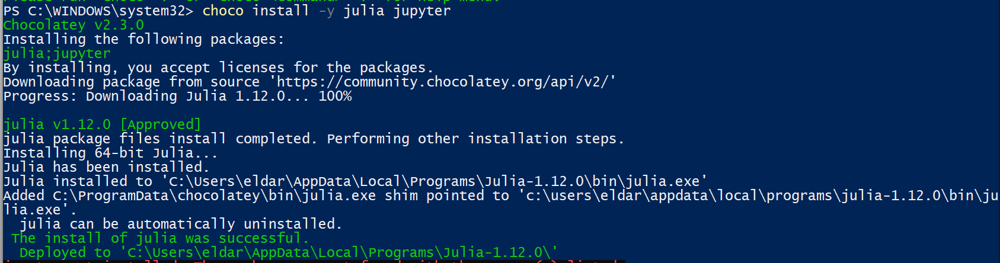{#fig:001}

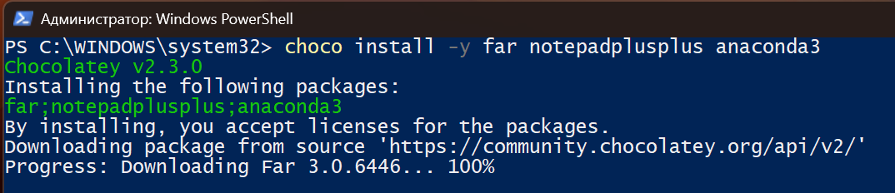{#fig:002}

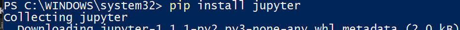{#fig:003}


После установки запустил Julia в режиме REPL (read-eval-print loop). После запуска Julia попал в режим командной строки.
Установил пакеты для работы с Jupyter. Для этого перешёл в пакетный режим Julia, нажав на клавиатуре знак закрывающейся квадратной скобки ] , затем ввёл ``` add IJulia ```.

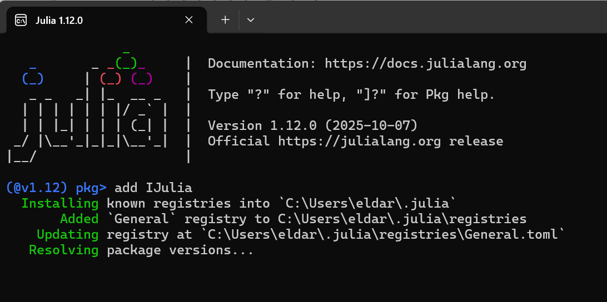{#fig:004}

Для интерактивной работы с Julia удобно использовать или Jupyter Notebook, или Jupyter Lab. По своей сути блокнот Jupyter позволяет объединить в единый документ
тест, программный код, результат его выполнения и визуализацию результата. Основная работа с блокнотами осуществляется посредством браузера. Формат документов (.ipynb)
идентичен в Jupyter Notebook и Jupyter Lab.


## Основы работы в блокноте Jupyter

Запустил Jupyter Lab.

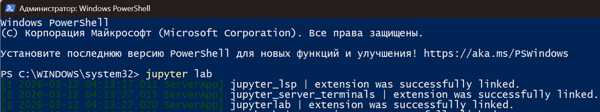{#fig:005}

Каждый блокнот (или консоль, или терминал, или текстовый редактор) располагается
в своей вкладке в основной рабочей области. Для создания нового блокнота выбрал
в меню File->New , далее указал, что именно создать - Notebook , затем ядро Juliia-1.x . 
Основная концепция интерактивных блокнотов — это ячейка, содержащая отдельный
фрагмент текста (или кода). Для написания текста в ячейке нужно в панели инструментов указать Markdown, для написания элемента кода — Code. Для изменения режимов
вставки ячеек можно использовать также комбинации клавиш. Для этого нужно на активной ячейке нажать ESC , что выведет ячейку из режима редактирования и переведёт
её в командный режим, в котором есть специальные сочетания клавиш для вставки /
вырезания / изменения ячеек:
– a или b — создать новую ячейку соответственно выше или ниже текущей;
– x — удалить ячейку;
– z — отмена удаления ячейки;
– m — перевести ячейку в режим текста;
– y — перевести ячейку в режим набора кода.
Для выполнения кода внутри ячейки выберите эту ячейку и нажмите Shift + Enter или
кнопку со значком Run на панели инструментов. Если ячейка содержит несколько строк
кода, то при выполнении этой ячейки отобразится только результат последней строки
(операции). Вывод результата можно подавить, завершив строку знаком «точка с запятой».


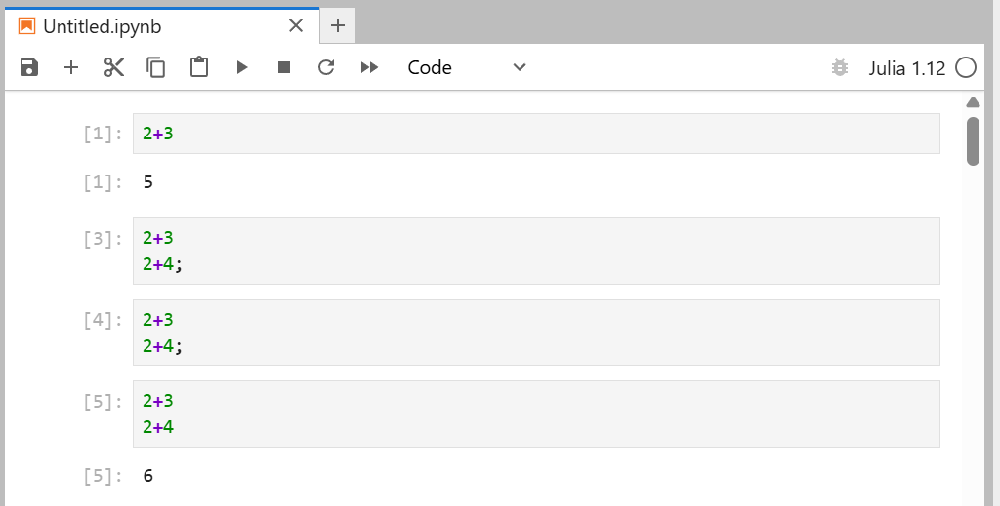{#fig:006}

Если необходимо получить информацию по работе с какой-то незнакомой для вас
функцией Julia, то надо поставить в ячейке перед названием этой функции знак вопроса

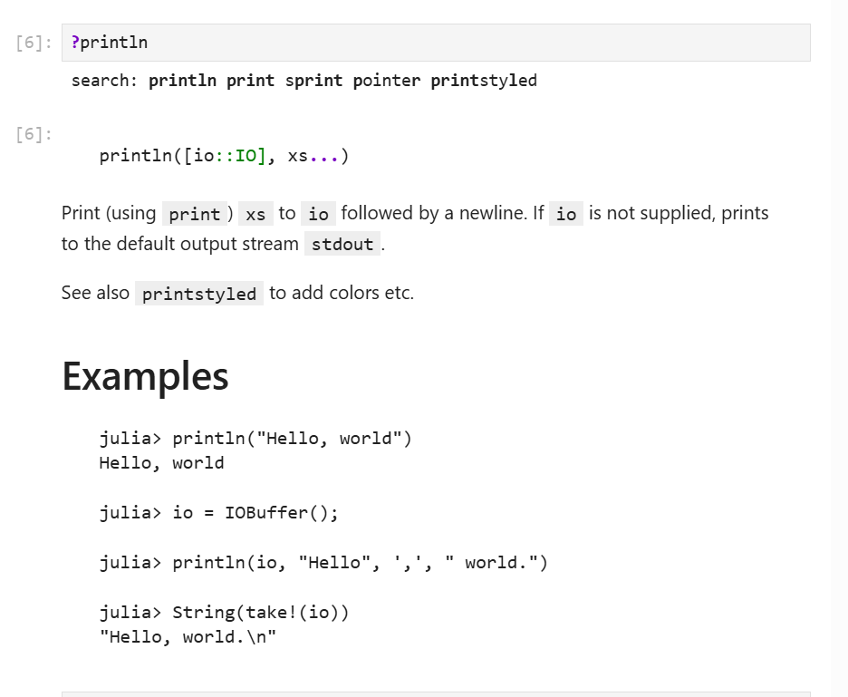{#fig:007}

Если требуется использовать команды из командной оболочки вашей операционной
системы, то перед соответствующей командой нужно поставить знак «точка с запятой».

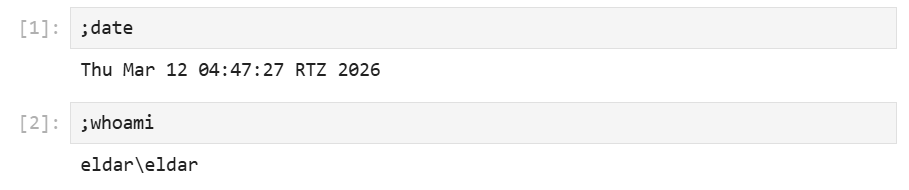{#fig:008}


## Основы синтаксиса Julia на примерах

Далее приведены простейшие примеры с использованием синтаксиса Julia, выполненные в блокноте Jupyter Lab.
Определил крайних значений диапазонов целочисленных числовых величин:

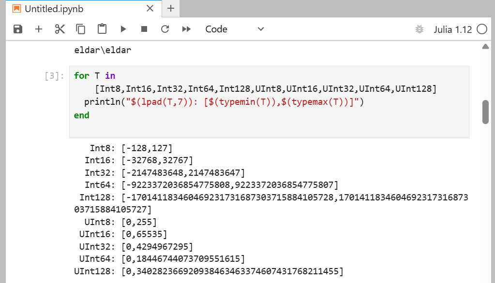{#fig:009}

Попробовал преобразование типов:

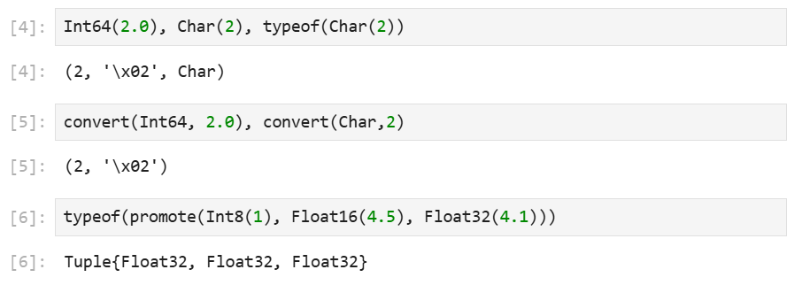{#fig:010}

Базовый синтаксис определения функции:

``` 
	function <Имя> (<СписокПараметров>)
		<Действия>
	end
```

Другой способ определения несложных функций:

``` <Имя> (<СписокПараметров>) = <Выражение> ```

Например, определим функцию $f(x)$ возведения переменной $x$ в квадрат и возведём

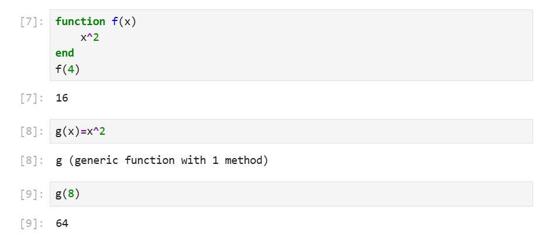{#fig:011}

Работа с массивами:

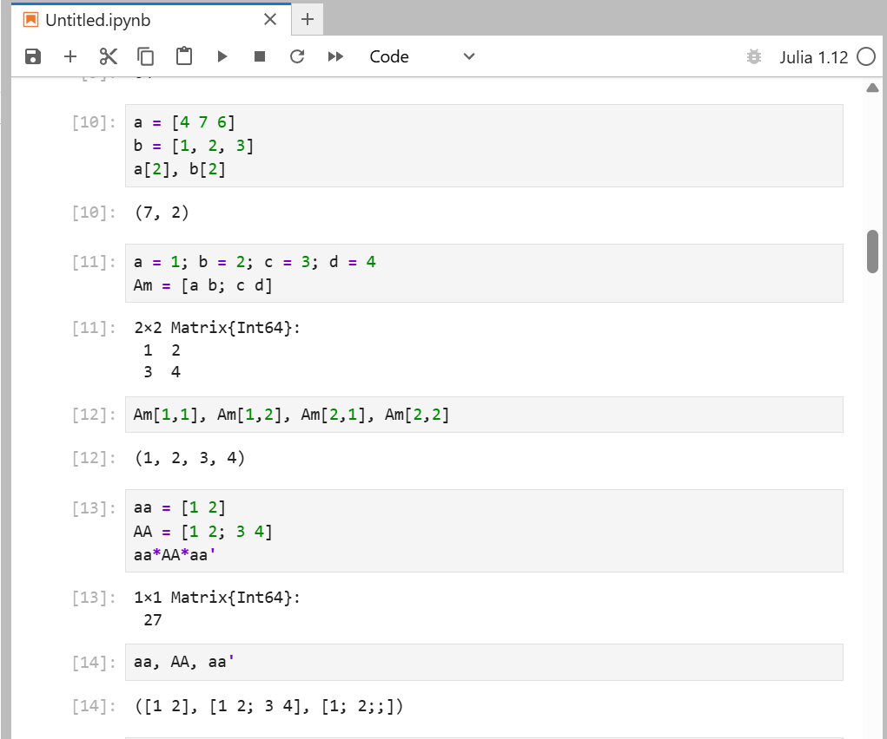{#fig:012}


## Задания для самостоятельной работы

1. Изучил документацию по основным функциям Julia для чтения / записи / вывода информации на экран: read(), readline(), readlines(), print(),
println(), show(), write().

Примеры использования функций:

- **read()**

Для этого создал текстовый файл:

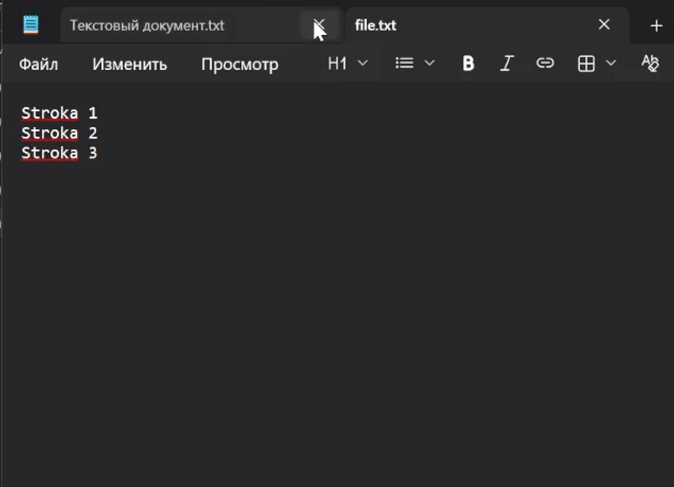{#fig:013}

Функция read() читает данные из потока в заданном формате.

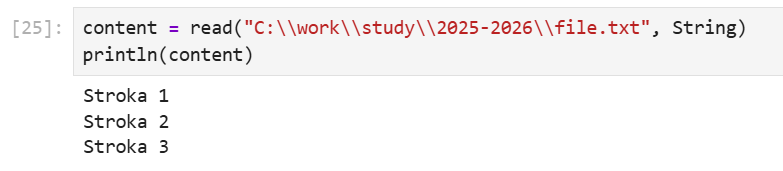{#fig:014}


- **readline()**

Читает одну строку из файла или потока до символа новой строки.

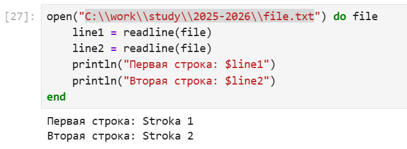{#fig:015}


- **readlines()**

Читает все строки файла и возвращает их в виде массива.

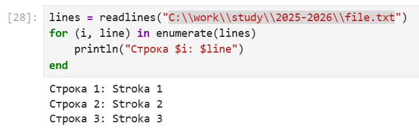{#fig:016}


- **print()**

Выводит данные в стандартный поток вывода (консоль) без добавления символа новой строки.

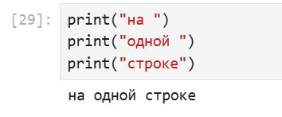{#fig:017}


- **println()**

Аналогично print(), но добавляет символ новой строки в конец.

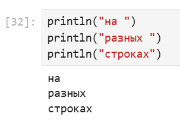{#fig:018}


- **show()**

Выводит внутреннее представление объекта, полезное для отладки.

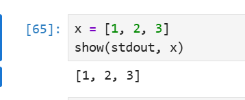{#fig:019}


- **write()**

Записывает данные в файл или поток.

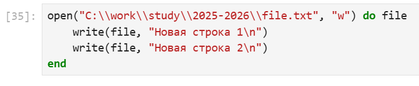{#fig:020}

Проверил файл:

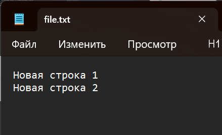{#fig:021}


2. Изучил документацию по функции parse() и опробовал.

Функция parse() преобразует строку в значение указанного типа.

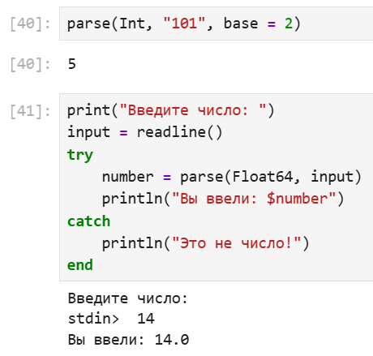{#fig:022}


3. Изучил синтаксис Julia для базовых математических операций с разным типом переменных: сложение, вычитание, умножение, деление, возведение в степень, извлечение корня, сравнение, логические операции.

Примеры использования функций:

- **Сложение**

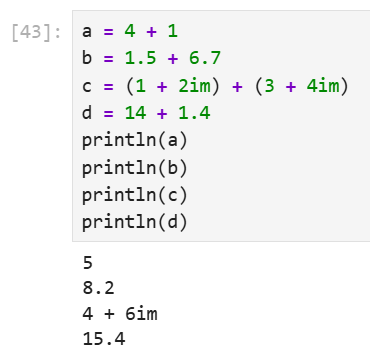{#fig:023}


- **Вычитание**

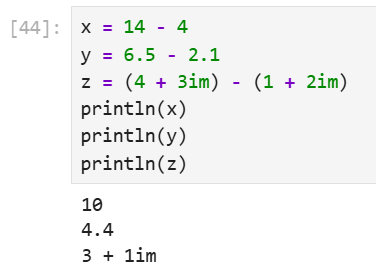{#fig:024}


- **Умножение**

Julia поддерживает неявное умножение: ax эквивалентно a * x

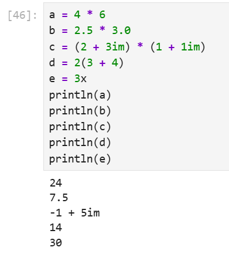{#fig:025}


- **Деление**

Julia поддерживает два вида деления:
- Обычное деление (/)
- Целочисленное деление (÷ или div())

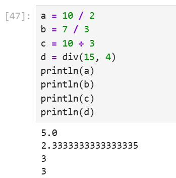{#fig:026}


- **Возведение в степень**

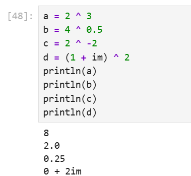{#fig:027}


- **Извлечение корня**

Julia поддерживает функции извлечения квадратного и кубического корней, а также извлечения корня произвольной степени путём возведения в степень.

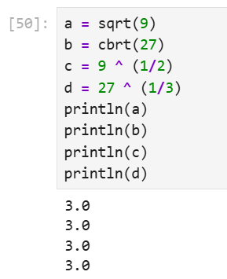{#fig:028}


- **Сравнение**

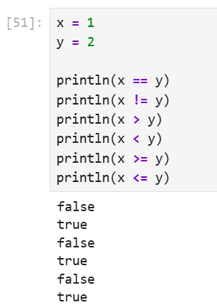{#fig:029}

Из-за погрешности вычислений чисел с плавающей точкой, существует следущее:

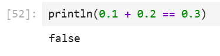{#fig:030}


- **Логические операции**

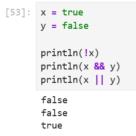{#fig:031}


4. Привёл несколько своих примеров с операциями над матрицами и векторами: сложение, вычитание, скалярное произведение, транспонирование, умножение на скаляр.

- **Сложение**

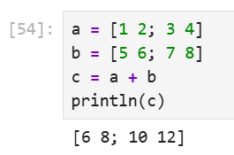{#fig:032}

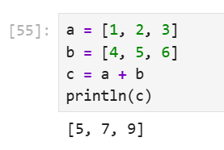{#fig:033}


- **Вычитание**


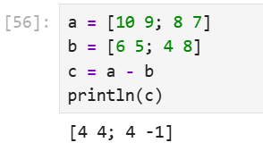{#fig:034}

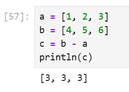{#fig:035}


- **Скалярное произведение**


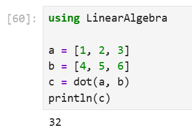{#fig:036}


- **Транспонирование**

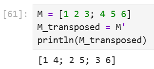{#fig:037}

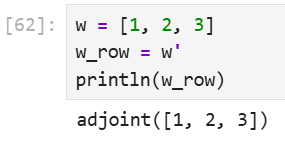{#fig:038}


- **Умножение на скаляр**

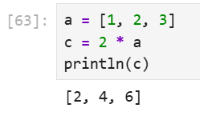{#fig:039}

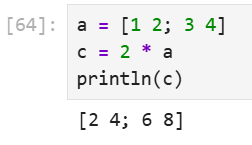{#fig:040}


# Выводы

 В результате выполнения лабораторной работы, я подготовил рабочее пространство и инструментарий для работы с языком программирования Julia, на простейших примерах познакомился с основами синтаксиса Julia.


