---
## Front matter
title: "Отчёт по лабораторной работе №2"
subtitle: "Дисциплина: Компьютерный практикум по статистическому анализу данных"
author: "Выполнил: Танрибергенов Эльдар (НПИбд-01-22)"

## Generic otions
lang: ru-RU
toc-title: "Содержание"

## Bibliography
bibliography: bib/cite.bib
csl: pandoc/csl/gost-r-7-0-5-2008-numeric.csl

## Pdf output format
toc: true # Table of contents
toc-depth: 2
lof: true # List of figures
lot: true # List of tables
fontsize: 12pt
linestretch: 1.5
papersize: a4
documentclass: scrreprt
## I18n polyglossia
polyglossia-lang:
  name: russian
  options:
	- spelling=modern
	- babelshorthands=true
polyglossia-otherlangs:
  name: english
## I18n babel
babel-lang: russian
babel-otherlangs: english
## Fonts
mainfont: IBM Plex Serif
romanfont: IBM Plex Serif
sansfont: IBM Plex Sans
monofont: IBM Plex Mono
mathfont: STIX Two Math
mainfontoptions: Ligatures=Common,Ligatures=TeX,Scale=0.94
romanfontoptions: Ligatures=Common,Ligatures=TeX,Scale=0.94
sansfontoptions: Ligatures=Common,Ligatures=TeX,Scale=MatchLowercase,Scale=0.94
monofontoptions: Scale=MatchLowercase,Scale=0.94,FakeStretch=0.9
mathfontoptions:
## Biblatex
biblatex: true
biblio-style: "gost-numeric"
biblatexoptions:
  - parentracker=true
  - backend=biber
  - hyperref=auto
  - language=auto
  - autolang=other*
  - citestyle=gost-numeric
## Pandoc-crossref LaTeX customization
figureTitle: "Рис."
tableTitle: "Таблица"
listingTitle: "Листинг"
lofTitle: "Список иллюстраций"
lotTitle: "Список таблиц"
lolTitle: "Листинги"
## Misc options
indent: true
header-includes:
  - \usepackage{indentfirst}
  - \usepackage{float} # keep figures where there are in the text
  - \floatplacement{figure}{H} # keep figures where there are in the text
---

# Цель работы

Основная цель работы — изучить несколько структур данных, реализованных в Julia, научиться применять их и операции над ними для решения задач.


# Предварительные сведения

Рассмотрим несколько структур данных, реализованных в Julia.
Несколько функций (методов), общих для всех структур данных:
– isempty() — проверяет, пуста ли структура данных;
– length() — возвращает длину структуры данных;
– in() — проверяет принадлежность элемента к структуре;
– unique() — возвращает коллекцию уникальных элементов структуры,
– reduce() — свёртывает структуру данных в соответствии с заданным бинарным оператором;
– maximum() (или minimum()) — возвращает наибольший (или наименьший) результат
вызова функции для каждого элемента структуры данных.

Кортеж (Tuple) — структура данных (контейнер) в виде неизменяемой индексируемой
последовательности элементов какого-либо типа (элементы индексируются с единицы).
Синтаксис определения кортежа:
```(element1, element2, ...)```

Словарь — неупорядоченный набор связанных между собой по ключу данных.
Синтаксис определения словаря:
```Dict(key1 => value1, key2 => value2, ...)```

Множество, как структура данных в Julia, соответствует множеству, как математическому объекту, то есть является неупорядоченной совокупностью элементов какого-либо
типа. Возможные операции над множествами: объединение, пересечение, разность; принадлежность элемента множеству.
Синтаксис определения множества:
```Set([itr])```
где itr — набор значений, сгенерированных данным итерируемым объектом или пустое множество.


Массив — коллекция упорядоченных элементов, размещённая в многомерной сетке. Векторы и матрицы являются частными случаями массивов.
Общий синтаксис одномерных массивов:
```array_name_1 = [element1, element2, ...]```
```array_name_2 = [element1 element2 ...]```

Некоторые операции для работы с массивами:
– length(A) — число элементов массива A;
– ndims(A) — число размерностей массива A;
– size(A) — кортеж размерностей массива A;
– size(A, n) — размерность массива A в заданном направлении;
– copy(A) — создание копии массива A;
– ones(), zeros() — создать массив с единицами или нулями соответственно;
– fill(value,array_name) — заполнение массива заранее определенным значением;
– sort() — сортировка элементов;
– collect() — вернуть массив всех элементов в коллекции или итераторе;
– reshape() — изменение размера массива;
– transpose() — транспонирование массива;


# Выполнение лабораторной работы


## Кортежи

Примеры кортежей:

1. Кортеж из элементов типа String:

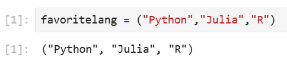{#fig:001}

2. Кортеж из целых чисел:

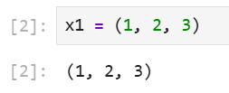{#fig:002}


3. Кортеж из элементов разных типов:

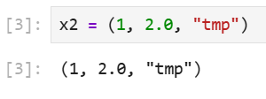{#fig:003}

4. Именованный кортеж:

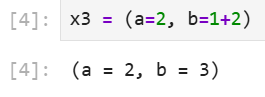{#fig:004}

Примеры операций над кортежами:

5. length(x2)

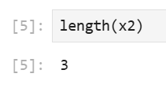{#fig:005}

6. Обратиться к элементам кортежа x2:

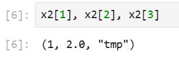{#fig:006}

7. Произвести какую-либо операцию (сложение) со вторым и третьим элементами кортежа x1:

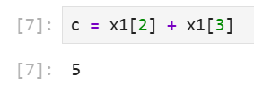{#fig:007}

8. Обращение к элементам именованного кортежа x3:

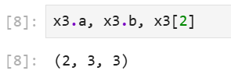{#fig:008}

9. Проверка вхождения элементов tmp и 0 в кортеж x2 (два способа обращения к методу in()):

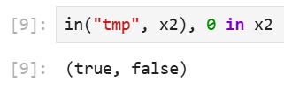{#fig:009}


## Словари

Примеры словарей и операций над ними:

1. Cоздать словарь с именем phonebook:

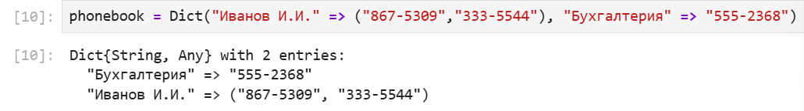{#fig:010}


2. Вывести ключи словаря:

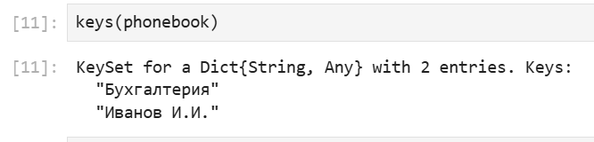{#fig:011}


3. Вывести значения элементов словаря:

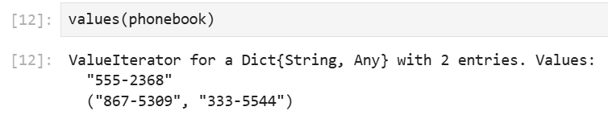{#fig:012}


4. Вывести заданные в словаре пары "ключ - значение":

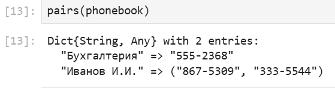{#fig:013}


5. Проверка вхождения ключа в словарь:

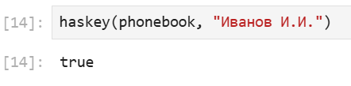{#fig:014}


6. Добавить элемент в словарь:

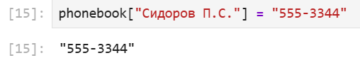{#fig:015}


7. Удалить ключ и связанные с ним значения из словаря

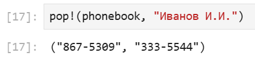{#fig:016}


8. Объединение словарей (функция merge()):

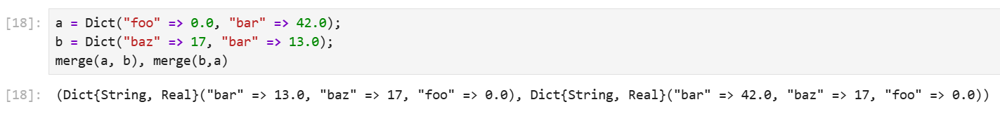{#fig:017}


## Множества

Примеры множеств и операций над ними:


1. Множество из четырёх целочисленных значений:

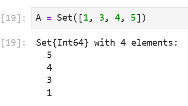{#fig:018}


2. Множество из 11 символьных значений:

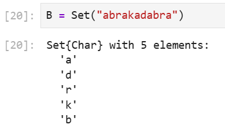{#fig:019}


3. Проверка эквивалентности двух множеств:

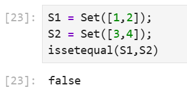{#fig:020}

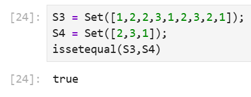{#fig:021}


4. Объединение множеств:

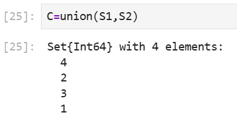{#fig:022}


5. Пересечение множеств:

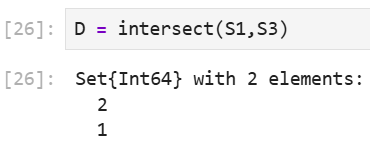{#fig:023}


6. Разность множеств:

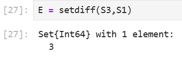{#fig:024}


7. Проверка вхождения элементов одного множества в другое:

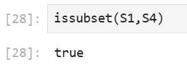{#fig:025}


8. Добавление элемента в множество:

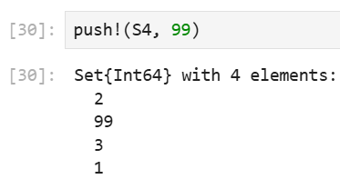{#fig:026}


9. Удаление последнего элемента множества:

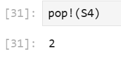{#fig:027}


## Массивы

Примеры массивов:

1. Cоздание пустого массива с абстрактным типом:

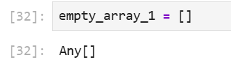{#fig:028}


2. Cоздание пустого массива с конкретным типом:

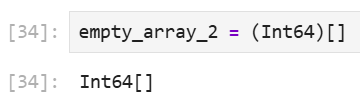{#fig:029}

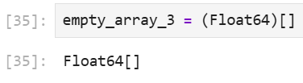{#fig:030}


3. Вектор-столбец:

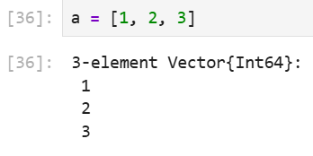{#fig:031}


4. Вектор-строка:

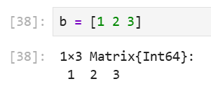{#fig:032}


5. Многомерные массивы (матрицы):

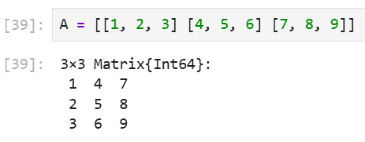{#fig:033}

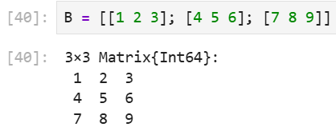{#fig:034}


6. Одномерный массив из 8 элементов (массив $1 \times 8$) со значениями, случайно распределёнными на интервале [0, 1):

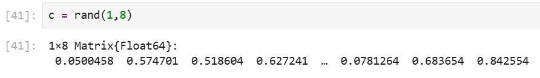{#fig:035}


7. Многомерный массив $2 \times 3$ (2 строки, 3 столбца) элементов со значениями, случайно распределёнными на интервале [0, 1):

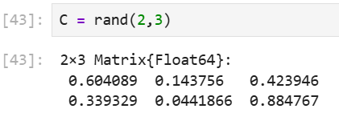{#fig:036}


8. Трёхмерный массив:

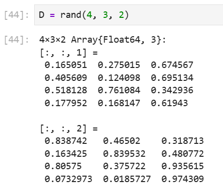{#fig:037}


Примеры массивов, заданных некоторыми функциями через включение:

9. Массив из квадратных корней всех целых чисел от 1 до 10:

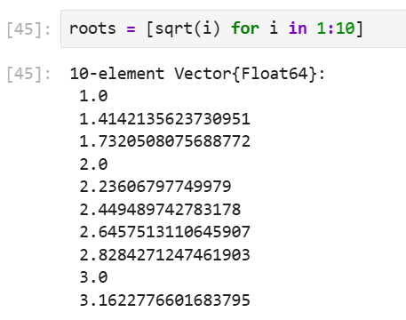{#fig:038}


10. Массив с элементами вида 3*x^2, где x - нечётное число от 1 до 9 (включительно)

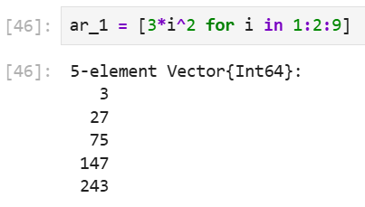{#fig:039}


11. Массив квадратов элементов, если квадрат не делится на 5 или 4:

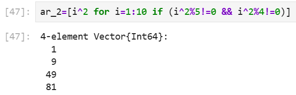{#fig:040}


12. Одномерный массив из пяти единиц:

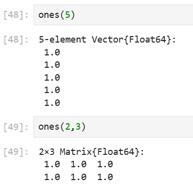{#fig:041}


13. Одномерный массив из 4 нулей:

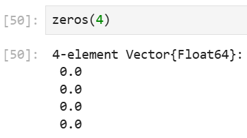{#fig:042}


14. Заполнить массив 3x2 цифрами 3.5

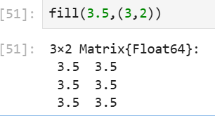{#fig:043}


15. Заполнение массива посредством функции repeat():

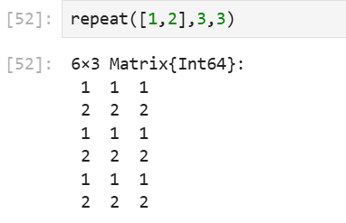{#fig:044}


16. Преобразование одномерного массива из целых чисел от 1 до 12 в двумерный массив 2x6

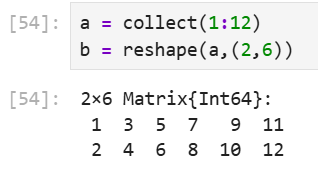{#fig:045}


17. Транспонирование

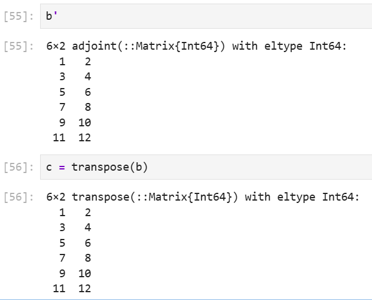{#fig:046}


18. Массив 10x5 целых чисел в диапазоне [10, 20]:

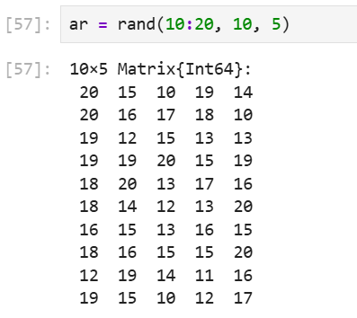{#fig:047}


19. Выбор всех значений строки в столбце 2:

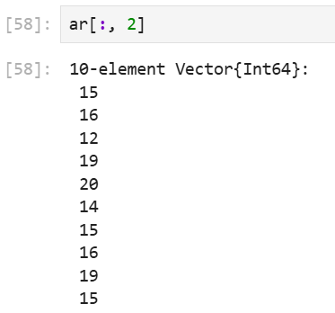{#fig:048}


20. Выбор всех значений в столбцах 2 и 5:

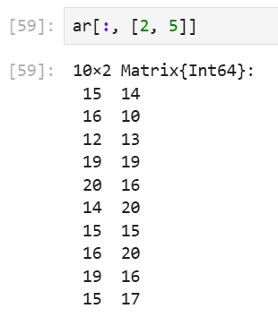{#fig:049}


21. Все значения строк в столбцах 2, 3 и 4:

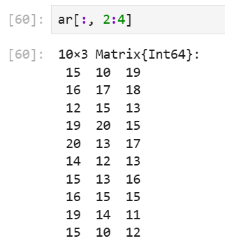{#fig:050}


22. Значения в строках 2, 4, 6 и в столбцах 1 и 5:

{#fig:051}


23. Значения в строке 1 от столбца 3 до последнего столбца:

{#fig:052}


24. Сортировка по столбцам:

{#fig:053}


25. Сортировка по строкам:

{#fig:054}


26. Поэлементное сравнение с числом (результат - массив логических значений):

{#fig:055}


27. Возврат индексов элементов массива, удовлетворяющих условию:

{#fig:056}


## Задания для самостоятельного выполнения

1.

{#fig:057}


2.

{#fig:058}

{#fig:059}

{#fig:060}

{#fig:061}

{#fig:062}

{#fig:063}

{#fig:064}

{#fig:065}


3.
3.1.

{#fig:066}


3.2.

{#fig:067}


3.3.

{#fig:068}


3.4.

{#fig:069}


3.5.

{#fig:070}


3.6.

{#fig:071}


3.7.

{#fig:072}


3.8.

{#fig:073}


3.9.

{#fig:074}


3.10.

{#fig:075}


3.11.

{#fig:076}


3.12.

{#fig:077}


3.13.

{#fig:078}


3.14.

{#fig:080}

{#fig:081}
{#fig:082}
{#fig:083}
{#fig:084}
{#fig:085}


4.

{#fig:086}

5.

{#fig:087}

6.
6.1.

{#fig:088}

6.2.

{#fig:089}

6.3.

{#fig:090}


# Выводы

В результате выполнения лабораторной работы, я изучил несколько структур данных, реализованных в Julia, научился применять их и операции над ними для решения задач.