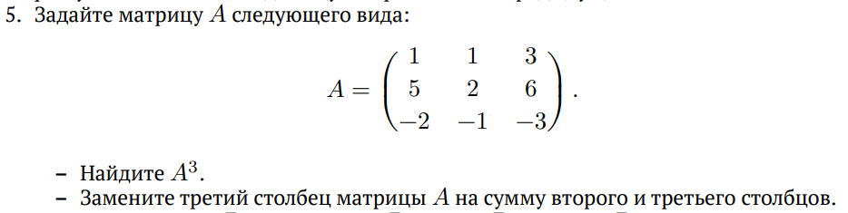
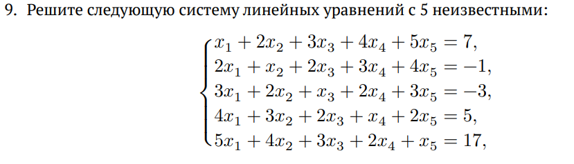
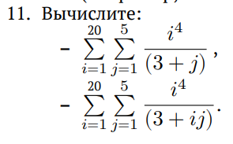

---
## Front matter
lang: ru-RU
title: Презентация по лабораторной работе №3
subtitle: Управляющие структуры Julia
author:
  - Компьютерный практикум по стат. анализу данных
institute:
  - Российский университет дружбы народов, Москва, Россия
date: 2026 г.

## i18n babel
babel-lang: russian
babel-otherlangs: english
## Fonts
mainfont: IBM Plex Serif
romanfont: IBM Plex Serif
sansfont: IBM Plex Sans
monofont: IBM Plex Mono
mathfont: STIX Two Math
mainfontoptions: Ligatures=Common,Ligatures=TeX,Scale=0.94
romanfontoptions: Ligatures=Common,Ligatures=TeX,Scale=0.94
sansfontoptions: Ligatures=Common,Ligatures=TeX,Scale=MatchLowercase,Scale=0.94
monofontoptions: Scale=MatchLowercase,Scale=0.94,FakeStretch=0.9
## Formatting pdf
toc: false
toc-title: Содержание
slide_level: 2
aspectratio: 169
section-titles: true
theme: metropolis
header-includes:
 - \metroset{progressbar=frametitle,sectionpage=progressbar,numbering=fraction}
---

# Информация

## Докладчик

  - Танрибергенов Эльдар
  - студент 4 курса из группы НПИбд-01-22
  - ФМиЕН, кафедра прикладной информатики и теории вероятностей
  - Российский университет дружбы народов


# Цели и задачи

## Цель работы

Основная цель работы — освоить применение циклов функций и сторонних для Julia пакетов для решения задач линейной алгебры и работы с матрицами.


## Задачи

- Изучить управляющие структуры Julia
- Познакомиться с вызовом сторонних библиотек
- Выполнить задания


# Результаты

## Управляющие структуры Julia

### Циклы while и for

:::::::::::::: {.columns align=center}
::: {.column width="50%"}

```


# Синтаксис while

while <условие>
	<тело цикла>
end
```

:::
::: {.column width="50%"}


```


# Синтаксис for

for <переменная> in <диапазон>
	<тело цикла>
end
```

:::
::::::::::::::


## Управляющие структуры Julia

### Примеры циклов while и for

:::::::::::::: {.columns align=center}
::: {.column width="33%"}

{#fig:001 height="60%"}

:::
::: {.column width="33%"}

{#fig:002 height="60%"}

:::
::: {.column width="33%"}

{#fig:003 height="60%"}

:::
::::::::::::::


## Управляющие структуры Julia

### Условные выражения

:::::::::::::: {.columns align=center}
::: {.column width="50%"}

```

# Синтаксис усл. выражений с ключ. словом

if <условие 1>
	<действие 1>
elseif <условие 2>
	<действие 2>
else
	<действие 3>
end
```

:::
::: {.column width="50%"}


```
# Синтаксис усл. выражений с тернарными операторами

a ? b : c 

```

если выполнено a, то выполнить b, если нет, то c

:::
::::::::::::::


## Управляющие структуры Julia

### Примеры с условными выражениями

:::::::::::::: {.columns align=center}
::: {.column width="50%"}

{#fig:004 height="60%"}

:::
::: {.column width="50%"}

{#fig:005 height="60%"}

:::
::::::::::::::


## Управляющие структуры Julia

### Функции

:::::::::::::: {.columns align=center}
::: {.column width="33%"}

{#fig:006 height="60%"}

:::
::: {.column width="33%"}

{#fig:007 height="60%"}

:::
::: {.column width="33%"}

{#fig:008 height="60%"}

:::
::::::::::::::


## Управляющие структуры Julia

### Функции

:::::::::::::: {.columns align=center}
::: {.column width="25%"}

{#fig:009 height="60%"}

:::
::: {.column width="25%"}

{#fig:010 height="60%"}

:::
::: {.column width="25%"}

{#fig:011 height="60%"}		

:::
::: {.column width="25%"}

{#fig:012 height="60%"}

:::
::::::::::::::


## Сторонние библиотеки (пакеты) в Julia

- Julia имеет более 2000 зарегистрированных пакетов, что делает их огромной частью экосистемы Julia
- Есть вызовы функций первого класса для других языков, обеспечивающие интерфейсы сторонних функций
- Можно вызвать функции из Python или R, например, с помощью PyCall или Rcall

:::::::::::::: {.columns align=center}
::: {.column width="50%"}

{#fig:013 height="40%"}

:::
::: {.column width="50%"}

{#fig:014 height="40%"}

:::
::::::::::::::


## Выполнение заданий

*2. Напишите условный оператор, который печатает число, если число чётное, и строку «нечётное», если число нечётное. Перепишите код, используя тернарный оператор.*

:::::::::::::: {.columns align=center}
::: {.column width="50%"}

{#fig:015 height="40%"}

:::
::: {.column width="50%"}

{#fig:016 height="40%"}

:::
::::::::::::::


## Выполнение заданий

{#fig:017 height="35%"}

:::::::::::::: {.columns align=center}
::: {.column width="50%"}

{#fig:018 height="35%"}

:::
::: {.column width="50%"}

{#fig:019 height="35%"}

:::
::::::::::::::


## Выполнение заданий

:::::::::::::: {.columns align=center}
::: {.column width="50%"}

{#fig:020 height="25%"}

:::
::: {.column width="50%"}

{#fig:021 height="60%"}

:::
::::::::::::::


## Выполнение заданий

:::::::::::::: {.columns align=center}
::: {.column width="50%"}

{#fig:022 height="40%"}

:::
::: {.column width="50%"}

{#fig:023 height="60%"}

:::
::::::::::::::


# Выводы
  
## Вывод

 В результате выполнения лабораторной работы, я освоил применение циклов функций и сторонних для Julia пакетов для решения задач линейной алгебры и работы с матрицами.