---
## Front matter
title: "Отчёт по лабораторной работе №3"
subtitle: "Дисциплина: Компьютерный практикум по статистическому анализу данных"
author: "Выполнил: Танрибергенов Эльдар (НПИбд-01-22)"

## Generic otions
lang: ru-RU
toc-title: "Содержание"

## Bibliography
bibliography: bib/cite.bib
csl: pandoc/csl/gost-r-7-0-5-2008-numeric.csl

## Pdf output format
toc: true # Table of contents
toc-depth: 2
lof: true # List of figures
lot: true # List of tables
fontsize: 12pt
linestretch: 1.5
papersize: a4
documentclass: scrreprt
## I18n polyglossia
polyglossia-lang:
  name: russian
  options:
	- spelling=modern
	- babelshorthands=true
polyglossia-otherlangs:
  name: english
## I18n babel
babel-lang: russian
babel-otherlangs: english
## Fonts
mainfont: IBM Plex Serif
romanfont: IBM Plex Serif
sansfont: IBM Plex Sans
monofont: IBM Plex Mono
mathfont: STIX Two Math
mainfontoptions: Ligatures=Common,Ligatures=TeX,Scale=0.94
romanfontoptions: Ligatures=Common,Ligatures=TeX,Scale=0.94
sansfontoptions: Ligatures=Common,Ligatures=TeX,Scale=MatchLowercase,Scale=0.94
monofontoptions: Scale=MatchLowercase,Scale=0.94,FakeStretch=0.9
mathfontoptions:
## Biblatex
biblatex: true
biblio-style: "gost-numeric"
biblatexoptions:
  - parentracker=true
  - backend=biber
  - hyperref=auto
  - language=auto
  - autolang=other*
  - citestyle=gost-numeric
## Pandoc-crossref LaTeX customization
figureTitle: "Рис."
tableTitle: "Таблица"
listingTitle: "Листинг"
lofTitle: "Список иллюстраций"
lotTitle: "Список таблиц"
lolTitle: "Листинги"
## Misc options
indent: true
header-includes:
  - \usepackage{indentfirst}
  - \usepackage{float} # keep figures where there are in the text
  - \floatplacement{figure}{H} # keep figures where there are in the text
---

# Цель работы

Основная цель работы — освоить применение циклов функций и сторонних для Julia пакетов для решения задач линейной алгебры и работы с матрицами.


# Выполнение лабораторной работы

## Циклы while и for

Для различных операций, связанных с перебором индексируемых элементов структур данных, традиционно используются циклы while и for.
Синтаксис while

```
while <условие>
	<тело цикла>
end
```

Например, while можно использовать для формирования элементов массива:

- Пока n<10 прибавить к n единицу и распечатать значение:

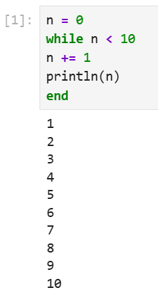{#fig:001}


Другой пример демонстрирует использование while при работе со строковыми элементами массива, подставляя имя из массива в заданную строку приветствия и выводя
получившуюся конструкцию на экран:

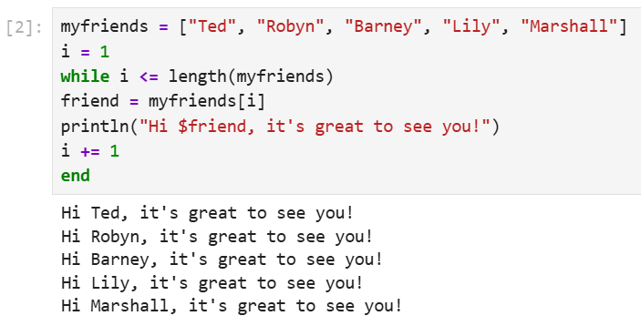{#fig:002}


Такие же результаты можно получить при использовании цикла for.
Синтаксис for

```
for <переменная> in <диапазон>
	<тело цикла>
end
```

Рассмотренные выше примеры, но с использованием цикла for:

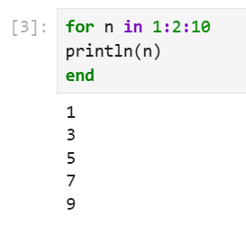{#fig:003}

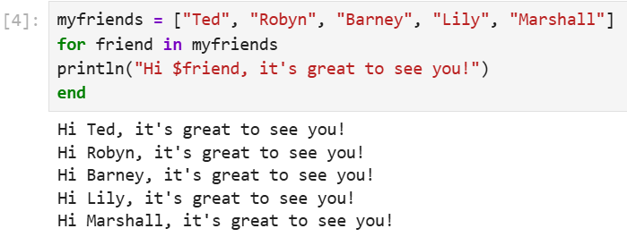{#fig:004}


Пример использования цикла for для создания двумерного массива, в котором значение каждой записи является суммой индексов строки и столбца:

- Инициализация массива m x n из нулей. Формирование массива, в котором значение каждой записи является суммой индексов строки и столбца:

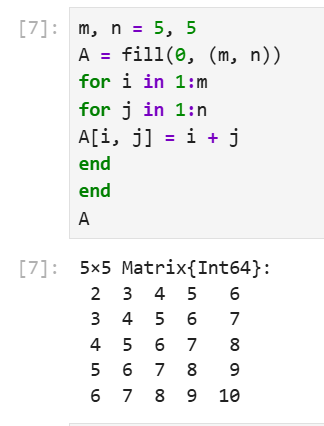{#fig:005}


Другая реализация этого же примера:

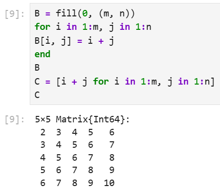{#fig:006}


## Условные выражения

Довольно часто при решении задач требуется проверить выполнение тех или иных условий. Для этого используют условные выражения.
Синтаксис условных выражений с ключевым словом:

```
if <условие 1>
	<действие 1>
elseif <условие 2>
	<действие 2>
else
	<действие 3>
end
```

Например, пусть для заданного числа 𝑁 требуется вывести слово «Fizz», если 𝑁 делится на 3, «Buzz», если 𝑁 делится на 5, и «FizzBuzz», если 𝑁 делится на 3 и 5. Используем ```&&``` для реализации операции "AND". Операция % вычисляет остаток от деления:

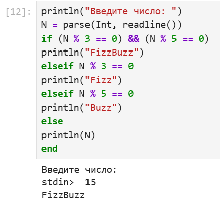{#fig:007}


Синтаксис условных выражений с тернарными операторами:

``` a ? b : c ```

(если выполнено a, то выполнить b, если нет, то c).

Такая запись эквивалентна записи условного выражения с ключевым словом:

```
if a
	b
else
	c
end
```

Пример использования тернарного оператора:

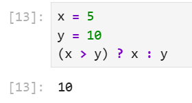{#fig:008}


## Функции


Julia дает нам несколько разных способов написать функцию. Первый требует ключевых слов function и end:

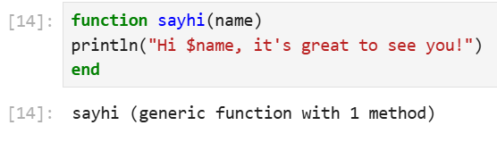{#fig:009}

- функция возведения в квадрат:

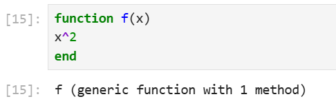{#fig:010}


Вызов функции осуществляется по её имени с указанием аргументов, например:

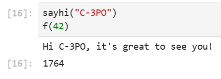{#fig:011}


В качестве альтернативы, можно объявить любую из выше определённых функций в одной строке:

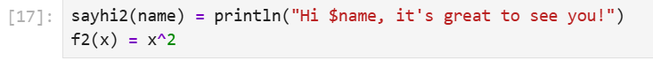{#fig:012}

Наконец, можно объявить выше определённые функции как «анонимные»:

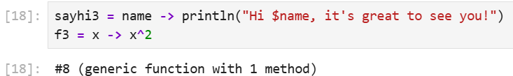{#fig:013}

По соглашению в Julia функции, сопровождаемые восклицательным знаком, изменяют
свое содержимое, а функции без восклицательного знака не делают этого.

Например, сравнил результат применения sort и sort!:

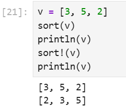{#fig:014}

Функция sort(v) возвращает отсортированный массив, который содержит те же
элементы, что и массив v, но исходный массив v остаётся без изменений. Если же использовать sort!(v), то отсортировано будет содержимое исходного массива v.
В программировании под функцией высшего порядка понимается функция, принимающая в качестве аргументов другие функции или возвращающая другую функцию
в качестве результата. Основная идея состоит в том, что функции имеют тот же статус,
что и другие объекты данных.
В Julia функция map является функцией высшего порядка, которая принимает функцию
в качестве одного из своих входных аргументов и применяет эту функцию к каждому
элементу структуры данных, которая ей передаётся также в качестве аргумента.
Например, в случае выполнения выражения:
``` map(f, [1, 2, 3]) ```
на выходе получим массив, в котором функция f была применена ко всем элементам массива [1, 2, 3]:
``` [f(1), f(2), f(3)] ```
Если $f(x) = x2$, то получим следующий результат:

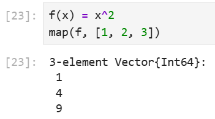{#fig:015}

То есть в квадрат возведены все элементы массива [1, 2, 3], но не сам массив (вектор).
В map можно передать и анонимно заданную, а не именованную функцию:

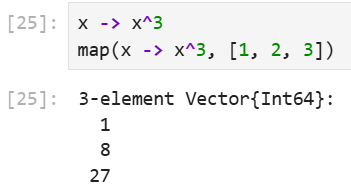{#fig:016}

Функция broadcast — ещё одна функция высшего порядка в Julia, представляющая собой обобщение функции map. Функция broadcast() будет пытаться привести все объекты
к общему измерению, map() будет напрямую применять данную функцию поэлементно.
Синтаксис для вызова broadcast такой же, как и для вызоваmap, например применение функции f к элементам массива [1, 2, 3]:

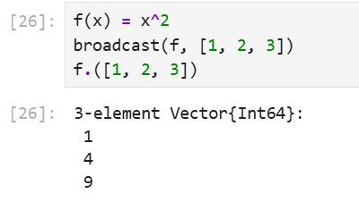{#fig:017}


Пример:

- Задаём матрицу A. Вызываем функцию f возведения в квадрат.

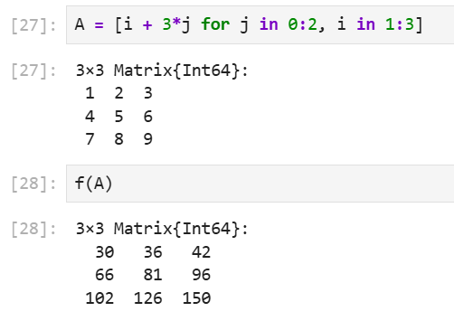{#fig:018}


С другой стороны B = f.(A)
Результат (содержит квадраты всех элементов A):

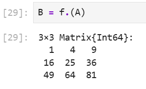{#fig:019}


Точечный синтаксис для broadcast() позволяет записать относительно сложные составные поэлементные выражения в форме, близкой к математической записи:

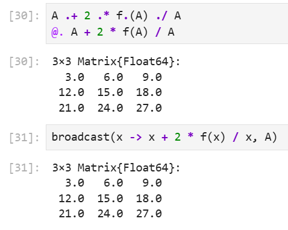{#fig:020}


## Сторонние библиотеки (пакеты) в Julia

Julia имеет более 2000 зарегистрированных пакетов, что делает их огромной частью
экосистемы Julia. Есть вызовы функций первого класса для других языков, обеспечивающие интерфейсы сторонних функций. Можно вызвать функции из Python или R,
например, с помощью PyCall или Rcall.

При первом использовании пакета в текущей установке Julia необходимо использовать менеджер пакетов, чтобы явно его добавить:

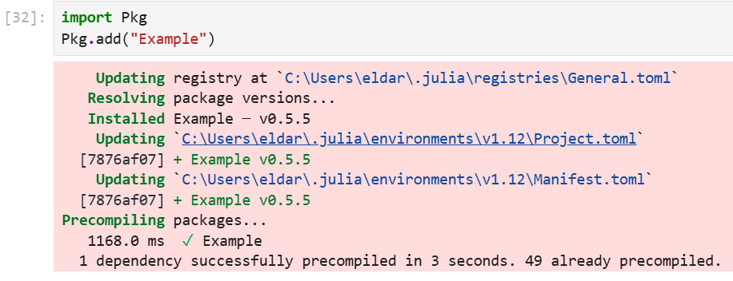{#fig:021}

При каждом новом использовании Julia (например, в начале нового сеанса в REPL
или открытии блокнота в первый раз) нужно загрузить пакет, используя ключевое слово using:

- Например, добавим и загрузим пакет Colors. Затем создадим палитру из 100 разных цветов, а затем определим матрицу 3 × 3 с элементами в форме случайного цвета из палитры,
используя функцию rand:

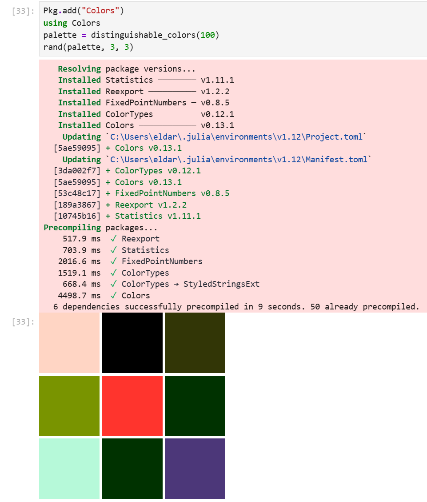{#fig:022}


## Задания для самостоятельного выполнения

1)

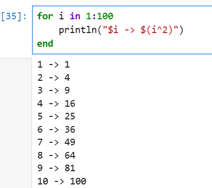{#fig:023}

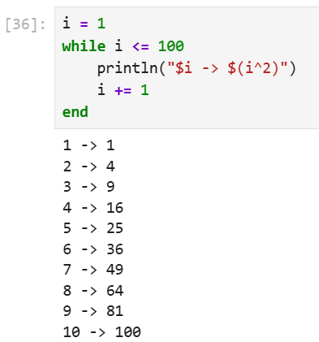{#fig:024}

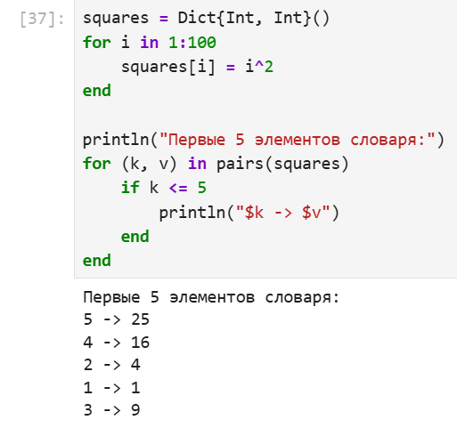{#fig:025}

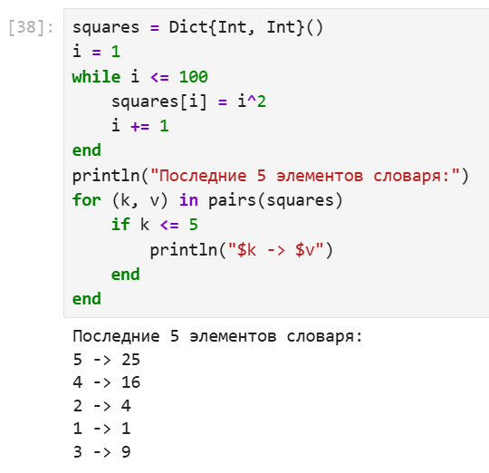{#fig:026}

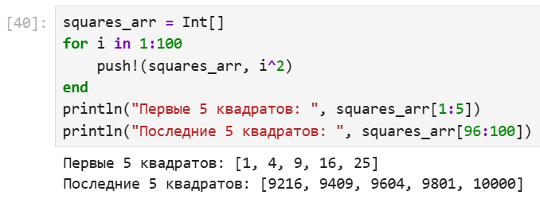{#fig:027}

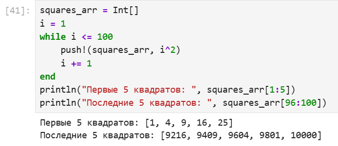{#fig:028}


2) 

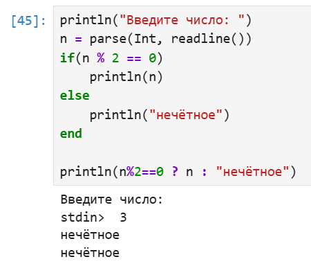{#fig:029}

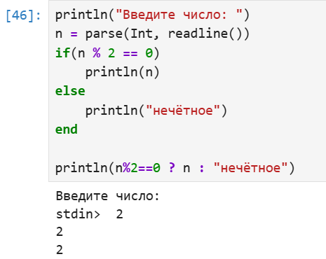{#fig:030}


3) 

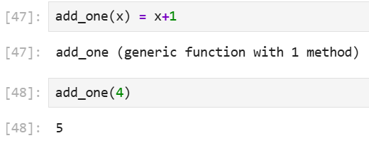{#fig:031}


4)

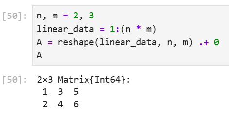{#fig:032}


5)

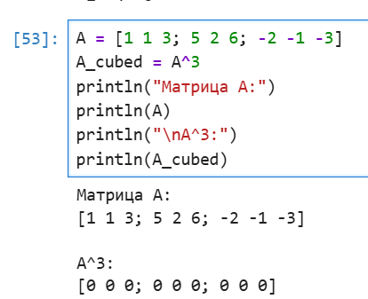{#fig:033}

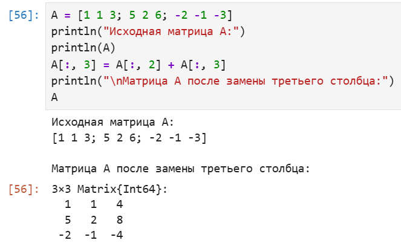{#fig:034}


6)

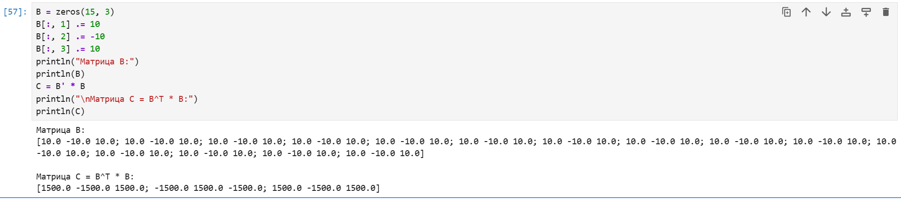{#fig:035}


7)

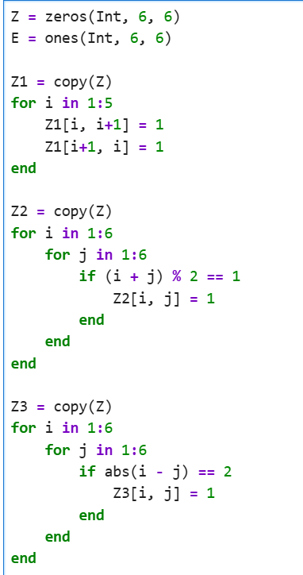{#fig:036}

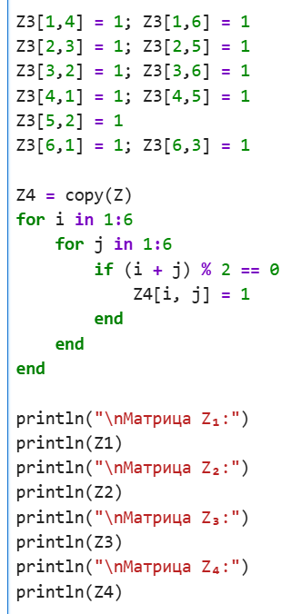{#fig:037}

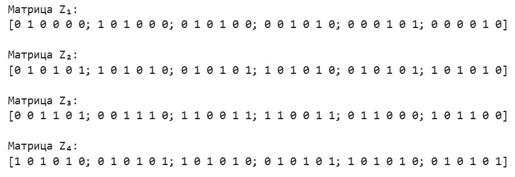{#fig:038}


8)

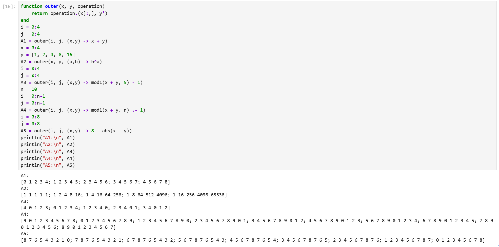{#fig:039}


9)

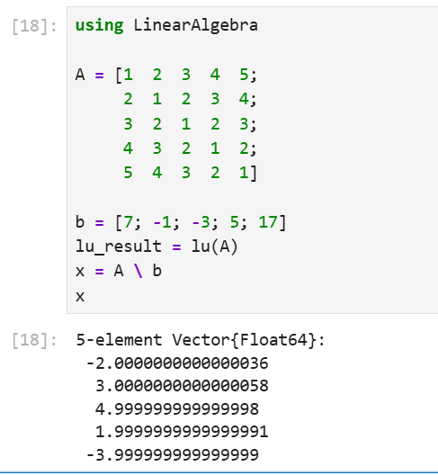{#fig:040}


10)

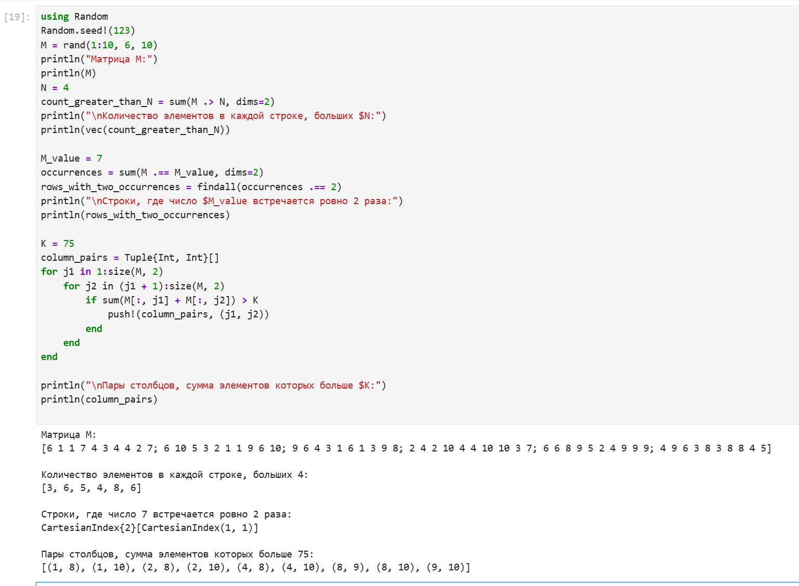{#fig:041}


11)

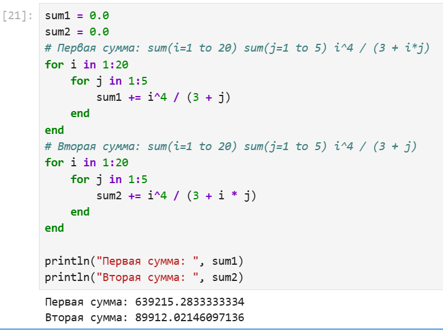{#fig:042}


# Выводы


В результате выполнения лабораторной работы, я освоил применение циклов функций и сторонних для Julia пакетов для решения задач линейной алгебры и работы с матрицами.


