---
## Front matter
title: "Отчёт по лабораторной работе №4"
subtitle: "Дисциплина: Компьютерный практикум по статистическому анализу данных"
author: "Выполнил: Танрибергенов Эльдар (НПИбд-01-22)"

## Generic otions
lang: ru-RU
toc-title: "Содержание"

## Bibliography
bibliography: bib/cite.bib
csl: pandoc/csl/gost-r-7-0-5-2008-numeric.csl

## Pdf output format
toc: true # Table of contents
toc-depth: 2
lof: true # List of figures
lot: true # List of tables
fontsize: 12pt
linestretch: 1.5
papersize: a4
documentclass: scrreprt
## I18n polyglossia
polyglossia-lang:
  name: russian
  options:
	- spelling=modern
	- babelshorthands=true
polyglossia-otherlangs:
  name: english
## I18n babel
babel-lang: russian
babel-otherlangs: english
## Fonts
mainfont: IBM Plex Serif
romanfont: IBM Plex Serif
sansfont: IBM Plex Sans
monofont: IBM Plex Mono
mathfont: STIX Two Math
mainfontoptions: Ligatures=Common,Ligatures=TeX,Scale=0.94
romanfontoptions: Ligatures=Common,Ligatures=TeX,Scale=0.94
sansfontoptions: Ligatures=Common,Ligatures=TeX,Scale=MatchLowercase,Scale=0.94
monofontoptions: Scale=MatchLowercase,Scale=0.94,FakeStretch=0.9
mathfontoptions:
## Biblatex
biblatex: true
biblio-style: "gost-numeric"
biblatexoptions:
  - parentracker=true
  - backend=biber
  - hyperref=auto
  - language=auto
  - autolang=other*
  - citestyle=gost-numeric
## Pandoc-crossref LaTeX customization
figureTitle: "Рис."
tableTitle: "Таблица"
listingTitle: "Листинг"
lofTitle: "Список иллюстраций"
lotTitle: "Список таблиц"
lolTitle: "Листинги"
## Misc options
indent: true
header-includes:
  - \usepackage{indentfirst}
  - \usepackage{float} # keep figures where there are in the text
  - \floatplacement{figure}{H} # keep figures where there are in the text
---

# Цель работы

Основной целью работы является изучение возможностей специализированных пакетов Julia для выполнения и оценки эффективности операций над объектами линейной алгебры.

# Выполнение лабораторной работы

## Поэлементные операции над многомерными массивами

Для матрицы 4 × 3 рассмотрим поэлементные операции сложения и произведения её элементов:

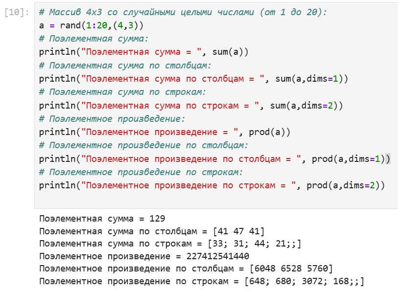{#fig:001}

Для работы со средними значениями можно воспользоваться возможностями пакета Statistics:

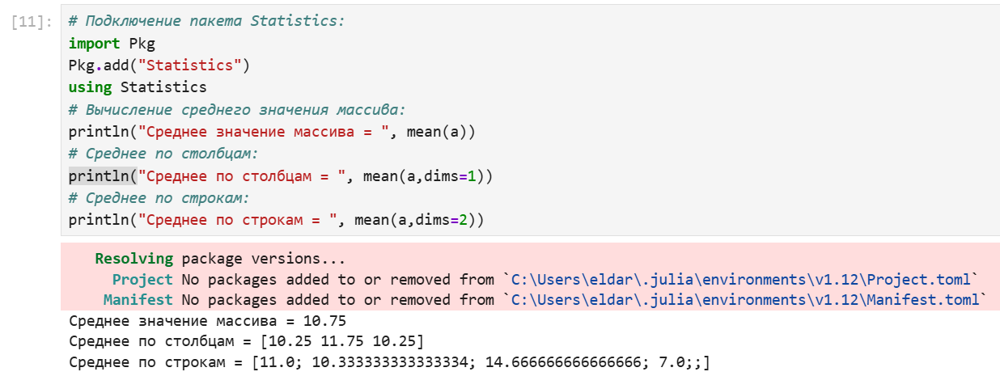{#fig:002}

## Транспонирование, след, ранг, определитель и инверсия матрицы

Для выполнения таких операций над матрицами, как транспонирование, диагонализация, определение следа, ранга, определителя матрицы и т.п. можно воспользоваться библиотекой (пакетом) LinearAlgebra:

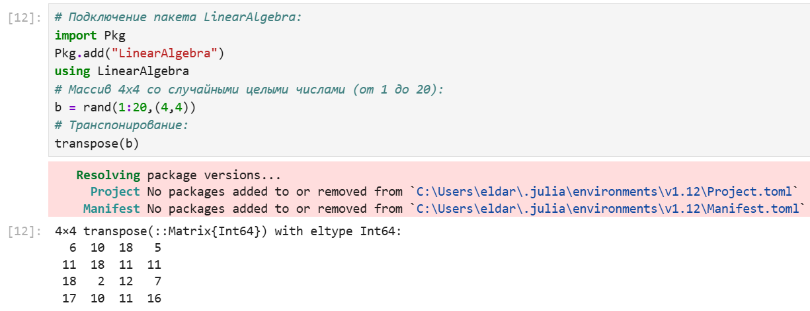{#fig:003}

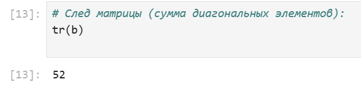{#fig:004}

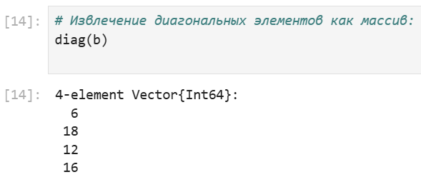{#fig:005}

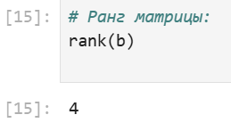{#fig:006}

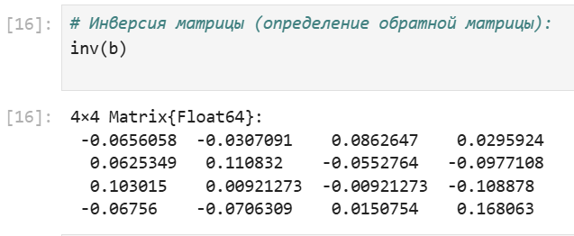{#fig:007}

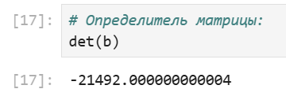{#fig:008}

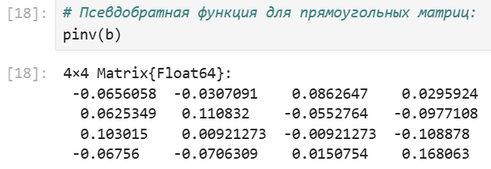{#fig:009}

## Вычисление нормы векторов и матриц, повороты, вращения

Для вычисления нормы используется LinearAlgebra.norm(x).

Евклидова норма:

$\| \vec{X} \|_2 = \sqrt{x_1^2 + x_2^2 + \ldots + x_n^2}$

p-норма:

$\| \vec{A} \|_p = \left( \sum_{i=1}^{n} |a_i|^p \right)^{1/p}$

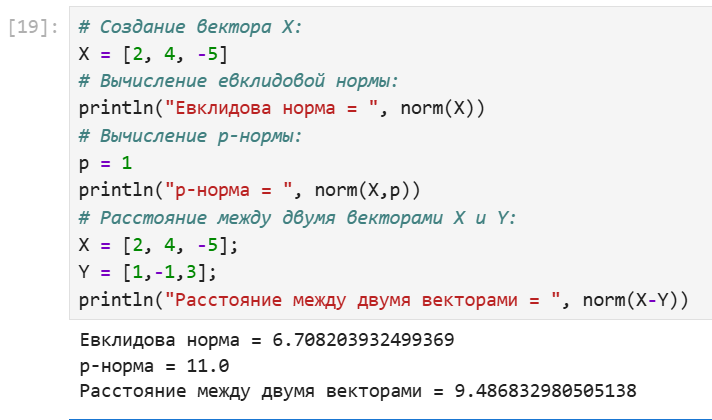{#fig:010}

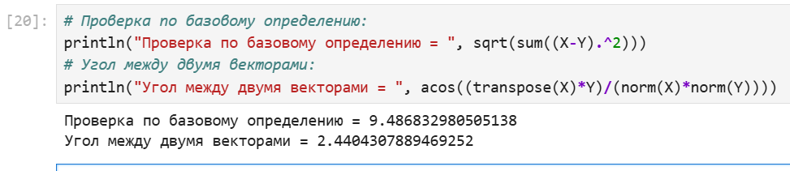{#fig:011}

Вычисление нормы для двумерной матрицы:

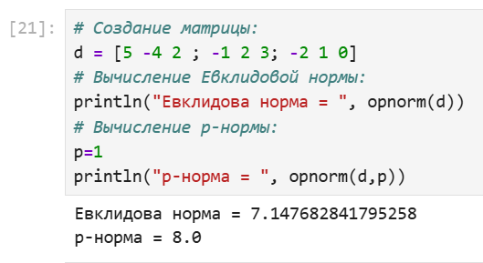{#fig:012}

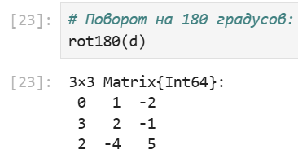{#fig:013}

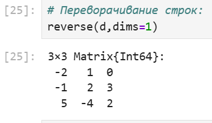{#fig:014}

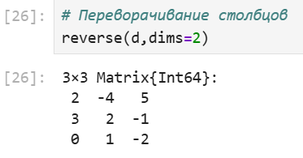{#fig:015}

## Матричное умножение, единичная матрица, скалярное произведение

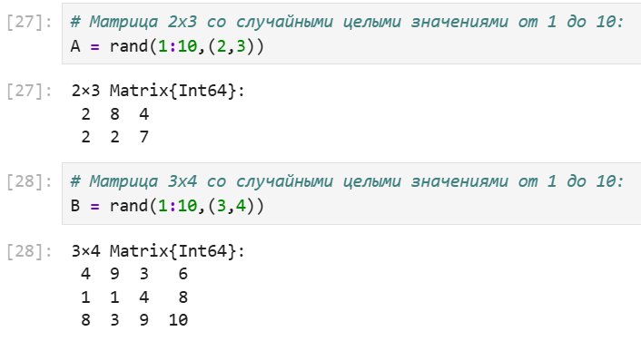{#fig:016}

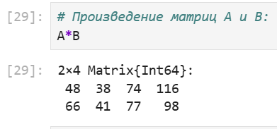{#fig:017}

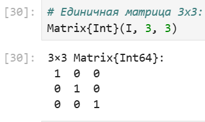{#fig:018}

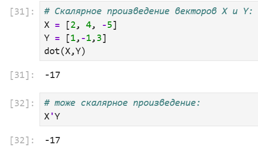{#fig:019}

## Факторизация. Специальные матричные структуры

В математике факторизация (или разложение) объекта — его декомпозиция (например,
числа, полинома или матрицы) в произведение других объектов или факторов, которые,
будучи перемноженными, дают исходный объект.
Матрица может быть факторизована на произведение матриц специального вида
для приложений, в которых эта форма удобна. К специальным видам матриц относят
ортогональные, унитарные и треугольные матрицы.
LU-разложение — представление матрицы A в виде произведения двух матриц L и U,
L — нижняя треугольная матрица, а U — верхняя треугольная матрица. LU-разложение
существует только в том случае, когда матрица A обратима, а все её ведущие (угловые) главные миноры невырождены.
Обращение матрицы A эквивалентно решению линейной системы AX = I, где X
— неизвестная матрица, I — единичная матрица. Решение X этой системы является
обратной матрицей A−1
.
LUP-разложение — представление матрицы A в виде произведения P A = LU, где
матрица L является нижнетреугольной с единицами на главной диагонали, U — верхнетреугольная общего вида матрица, P — матрица перестановок, получаемая из единичной
матрицы путём перестановки строк или столбцов.
QR-разложение матрицы — представление матрицы в виде произведения унитарной (или ортогональной) матрицы Q и верхнетреугольной матрицы R. QR-разложение
применяется для нахождения собственных векторов и собственных значений матрицы.
Q является ортогональной матрицей, если $Q^T$Q = I, где I — единичная матрица.
Спектральное разложение матрицы A — представление её в виде произведения
A = V ΛV −1, где V — матрица, столбцы которой являются собственными векторами
матрицы A, Λ — диагональная матрица с соответствующими собственными значениями
на главной диагонали, $V^−1$ — матрица, обратная матрице V.
Рассмотрим несколько примеров. Для работы со специальными матричными структурами потребуется пакет LinearAlgebra.
Решение систем линейный алгебраических уравнений Ax = b:

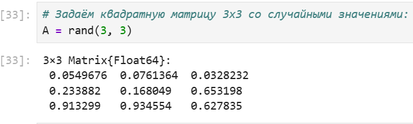{#fig:020}

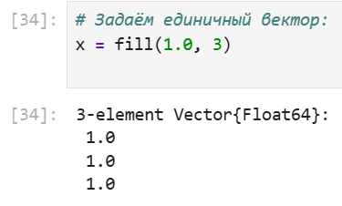{#fig:021}

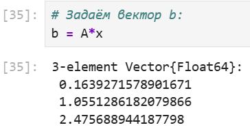{#fig:022}

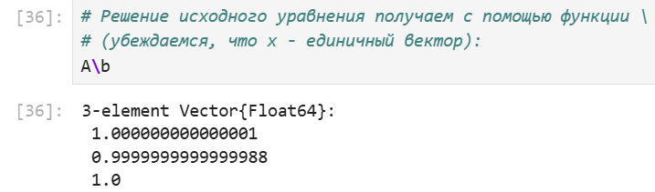{#fig:023}

Julia позволяет вычислять LU-факторизацию и определяет составной тип факторизации для его хранения

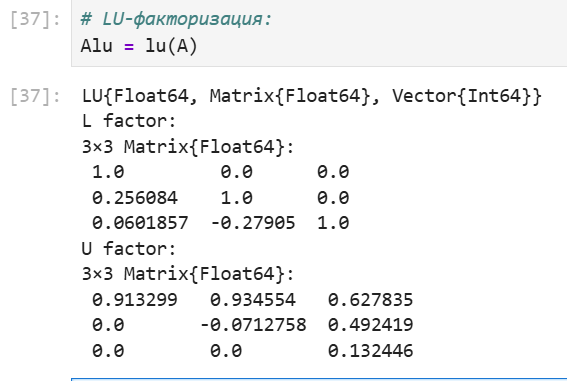{#fig:024}

Различные части факторизации могут быть извлечены путём доступа к их специальным свойствам:

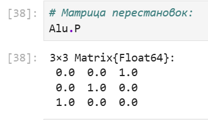{#fig:025}

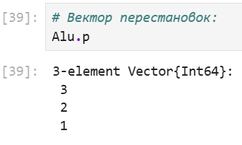{#fig:026}

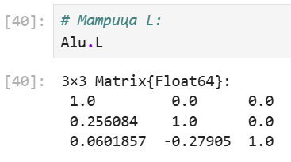{#fig:027}

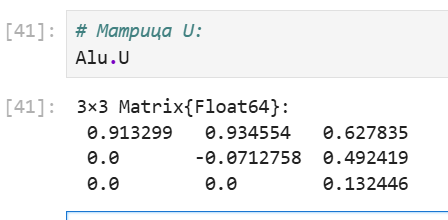{#fig:028}

Исходная система уравнений 𝐴𝑥 = 𝑏 может быть решена или с использованием
исходной матрицы, или с использованием объекта факторизации:

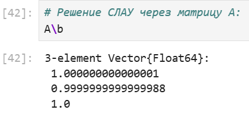{#fig:029}

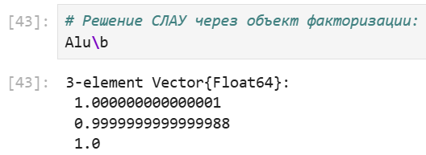{#fig:030}

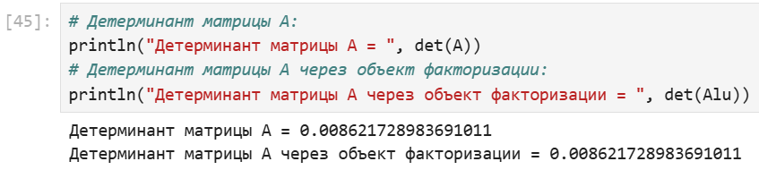{#fig:031}

Julia позволяет вычислять QR-факторизацию и определяет составной тип факторизации для его хранения:

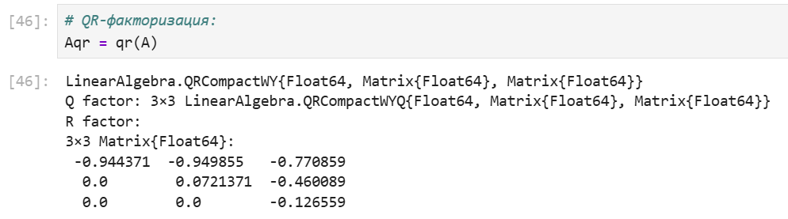{#fig:032}

По аналогии с LU-факторизацией различные части QR-факторизации могут быть извлечены путём доступа к их специальным свойствам:

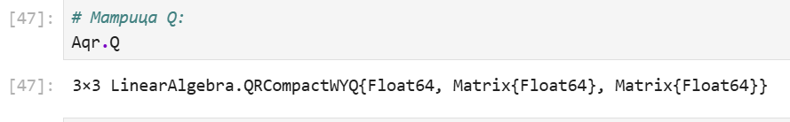{#fig:033}

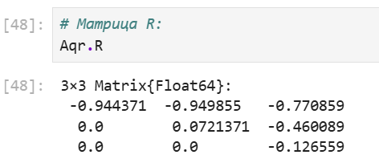{#fig:034}

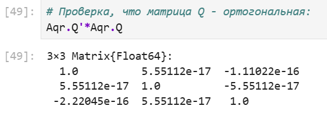{#fig:035}

Примеры собственной декомпозиции матрицы A:

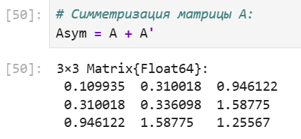{#fig:036}

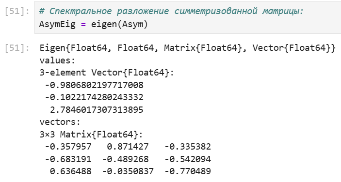{#fig:037}

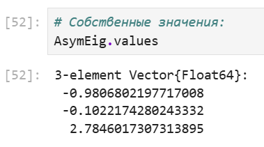{#fig:038}

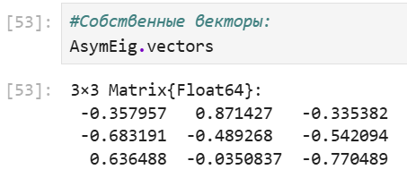{#fig:039}

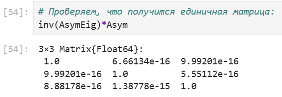{#fig:040}

Далее рассмотрим примеры работы с матрицами большой размерности и специальной структуры.

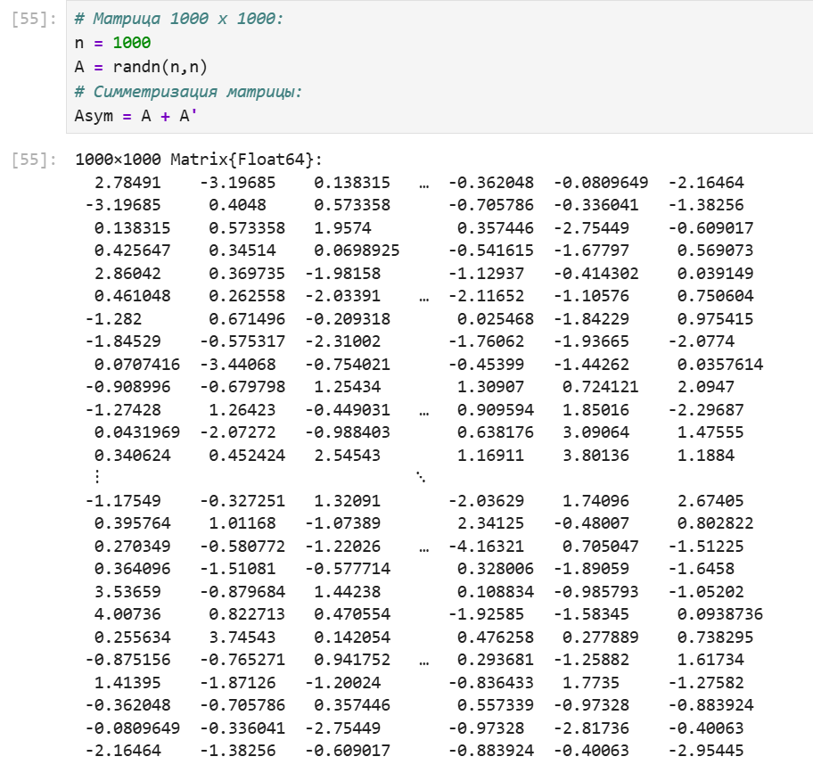{#fig:041}

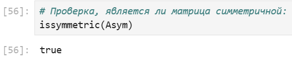{#fig:042}

Пример добавления шума в симметричную матрицу (матрица уже не будет симметричной):

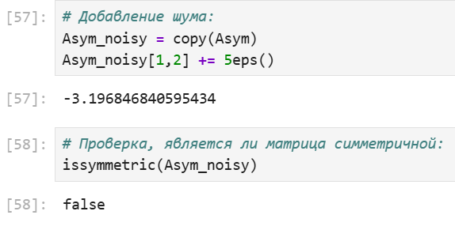{#fig:043}

В Julia можно объявить структуру матрица явно, например, используя Diagonal,
Triangular, Symmetric, Hermitian, Tridiagonal и SymTridiagonal:

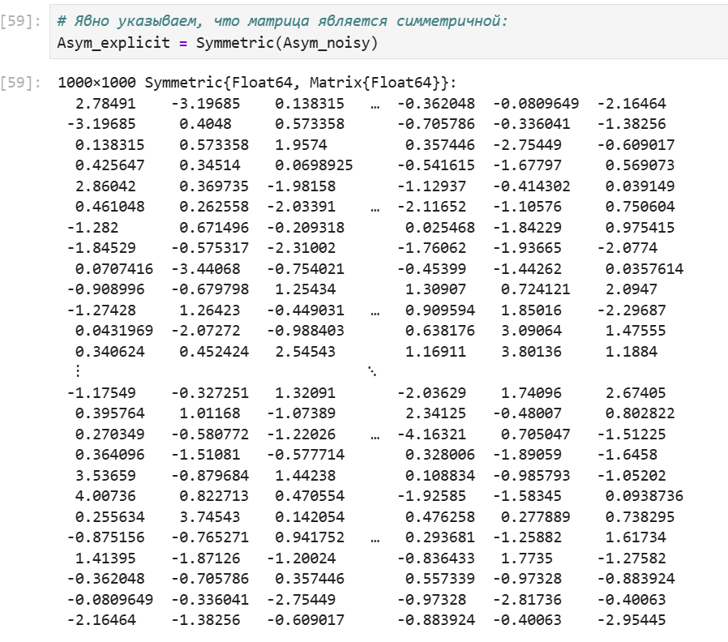{#fig:044}

Далее для оценки эффективности выполнения операций над матрицами большой
размерности и специальной структуры воспользуемся пакетом BenchmarkTools:

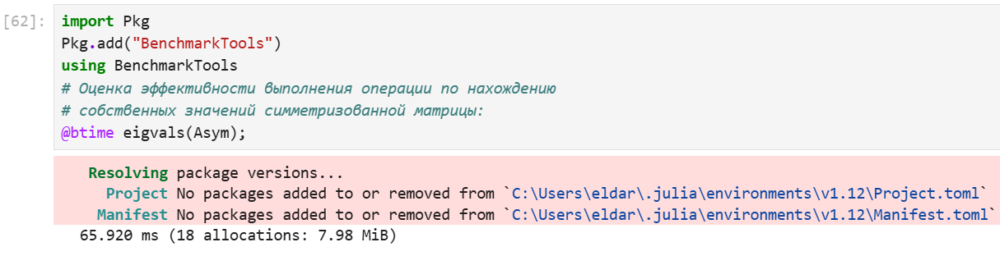{#fig:045}

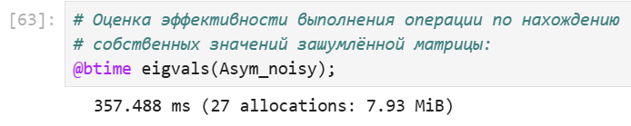{#fig:046}

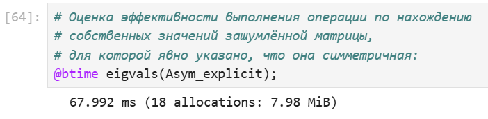{#fig:047}

Далее рассмотрим примеры работы с разряженными матрицами большой размерности.
Использование типов Tridiagonal и SymTridiagonal для хранения трёхдиагональных матриц позволяет работать с потенциально очень большими трёхдиагональными
матрицами:

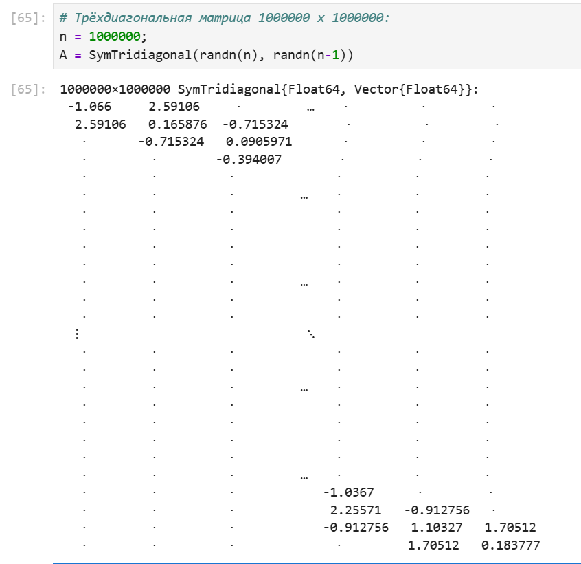{#fig:048}

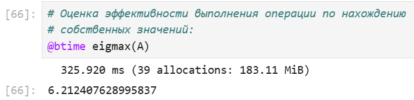{#fig:049}

При попытке задать подобную матрицу обычным способом и посчитать её собственные
значения, вы скорее всего получите ошибку переполнения памяти.

## Общая линейная алгебра

Обычный способ добавить поддержку числовой линейной алгебры - это обернуть
подпрограммы BLAS и LAPACK. Собственно, для матриц с элементами Float32,Float64,
Complex {Float32} или Complex {Float64} разработчики Julia использовали такое же
решение. Однако Julia также поддерживает общую линейную алгебру, что позволяет,
например, работать с матрицами и векторами рациональных чисел.
Для задания рационального числа используется двойная косая черта:
1//2
В следующем примере показано, как можно решить систему линейных уравнений с рациональными элементами без преобразования в типы элементов с плавающей запятой
(для избежания проблемы с переполнением используем BigInt):

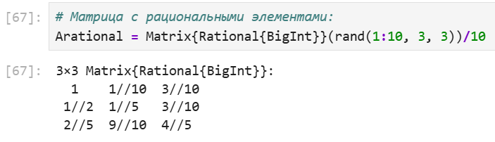{#fig:050}

{#fig:051}

{#fig:052}

{#fig:053}

{#fig:054}

## Задания для самостоятельного выполнения

1.

{#fig:055}

2. 

{#fig:056}

3.

{#fig:057}

{#fig:058}

4.

{#fig:059}

{#fig:060}

{#fig:061}

{#fig:062}

5.

{#fig:063}

{#fig:064}

6.

{#fig:065}

{#fig:066}

{#fig:067}

7.

{#fig:068}

{#fig:069}

8.

{#fig:070}

{#fig:071}

{#fig:072}

# Выводы

В результате выполнения лабораторной работы, я изучил возможности специализированных пакетов Julia для выполнения и оценки эффективности операций над объектами линейной алгебры.
