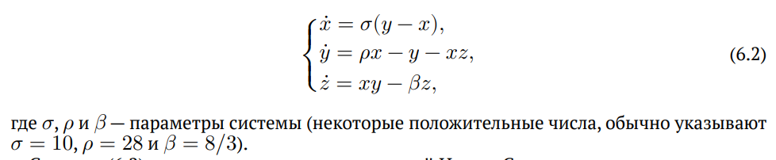
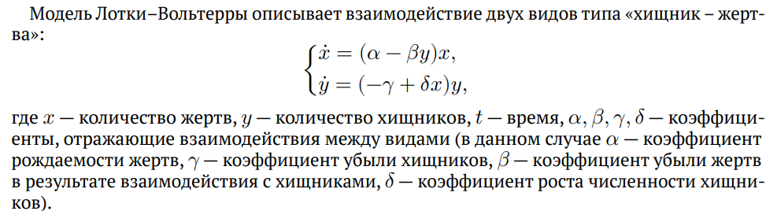

---
## Front matter
title: "Отчёт по лабораторной работе №6"
subtitle: "Дисциплина: Компьютерный практикум по статистическому анализу данных"
author: "Выполнил: Танрибергенов Эльдар (НПИбд-01-22)"

## Generic otions
lang: ru-RU
toc-title: "Содержание"

## Bibliography
bibliography: bib/cite.bib
csl: pandoc/csl/gost-r-7-0-5-2008-numeric.csl

## Pdf output format
toc: true # Table of contents
toc-depth: 2
lof: true # List of figures
lot: true # List of tables
fontsize: 12pt
linestretch: 1.5
papersize: a4
documentclass: scrreprt
## I18n polyglossia
polyglossia-lang:
  name: russian
  options:
	- spelling=modern
	- babelshorthands=true
polyglossia-otherlangs:
  name: english
## I18n babel
babel-lang: russian
babel-otherlangs: english
## Fonts
mainfont: IBM Plex Serif
romanfont: IBM Plex Serif
sansfont: IBM Plex Sans
monofont: IBM Plex Mono
mathfont: STIX Two Math
mainfontoptions: Ligatures=Common,Ligatures=TeX,Scale=0.94
romanfontoptions: Ligatures=Common,Ligatures=TeX,Scale=0.94
sansfontoptions: Ligatures=Common,Ligatures=TeX,Scale=MatchLowercase,Scale=0.94
monofontoptions: Scale=MatchLowercase,Scale=0.94,FakeStretch=0.9
mathfontoptions:
## Biblatex
biblatex: true
biblio-style: "gost-numeric"
biblatexoptions:
  - parentracker=true
  - backend=biber
  - hyperref=auto
  - language=auto
  - autolang=other*
  - citestyle=gost-numeric
## Pandoc-crossref LaTeX customization
figureTitle: "Рис."
tableTitle: "Таблица"
listingTitle: "Листинг"
lofTitle: "Список иллюстраций"
lotTitle: "Список таблиц"
lolTitle: "Листинги"
## Misc options
indent: true
header-includes:
  - \usepackage{indentfirst}
  - \usepackage{float} # keep figures where there are in the text
  - \floatplacement{figure}{H} # keep figures where there are in the text
---

# Цель работы

Основной целью работы является освоение специализированных пакетов для решения задач в непрерывном и дискретном времени.

# Выполнение лабораторной работы

## Решение обыкновенных дифференциальных уравнений

Обыкновенное дифференциальное уравнение (ОДУ) описывает изменение некоторой переменной $u$:
$u'(t) = f(u(t), p, t)$ , где $f(u(t), p, t)$ — нелинейная модель (функция) изменения $u(t)$ с заданным начальным
значением $u(t_0) = u_0$, $p$ — параметры модели, $t$ — время.
Для решения обыкновенных дифференциальных уравнений (ОДУ) в Julia можно использовать пакет diffrentialEquations.jl.

### Модель экспоненциального роста

Рассмотрим пример использования этого пакета для решение уравнения модели экспоненциального роста, описываемую уравнением

$u′(t) = \alpha u(t), u(0) = u_0$, где $\alpha$ — коэффициент роста.Предположим, что заданы следующие начальные данные $\alpha = 0.98$, u(0) = 1,0, $t \in [0; 1,0]$.

Аналитическое решение модели имеет вид:

$u(t) = u_0 exp(\alpha t)u(t)$.

Численное решение в Julia будет иметь следующий вид:

{#fig:001}

{#fig:002}

При построении одного из графиков использовался вызов sol.t, чтобы захватить
массив моментов времени. Массив решений можно получить, воспользовавшись sol.u.
Если требуется задать точность решения, то можно воспользоваться параметрами
abstol (задаёт близость к нулю) и reltol (задаёт относительную точность).

{#fig:003}

{#fig:004}

### Система Лоренца

Динамической системой Лоренца является нелинейная автономная система обыкновенных дифференциальных уравнений третьего порядка:

{#fig:005}

Система получена из системы уравнений Навье–Стокса и описывает движение
воздушных потоков в плоском слое жидкости постоянной толщины при разложении
скорости течения и температуры в двойные ряды Фурье с последующем усечением до
первых-вторых гармоник.
Решение системы неустойчиво на аттракторе, что не позволяет применять классические численные методы на больших отрезках времени, требуется использовать
высокоточные вычисления.
Численное решение в Julia будет иметь следующий вид:

{#fig:006}

{#fig:007}

{#fig:008}

## Модель Лотки–Вольтерры

{#fig:009}

Численное решение в Julia будет иметь следующий вид:

{#fig:010}

{#fig:011}

{#fig:012}

## Задания для самостоятельного выполнения

1.

{#fig:013}

{#fig:014}

2.

{#fig:015}

{#fig:016}

3.

{#fig:017}

{#fig:018}

# Выводы

 В результате выполнения лабораторной работы, я освоил специализированные пакеты для решения задач в непрерывном и дискретном времени.
