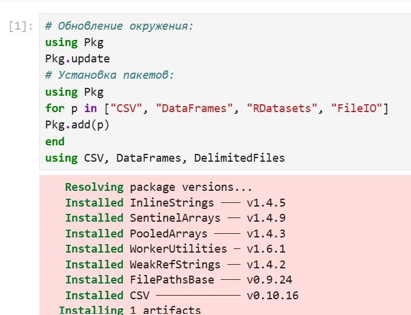
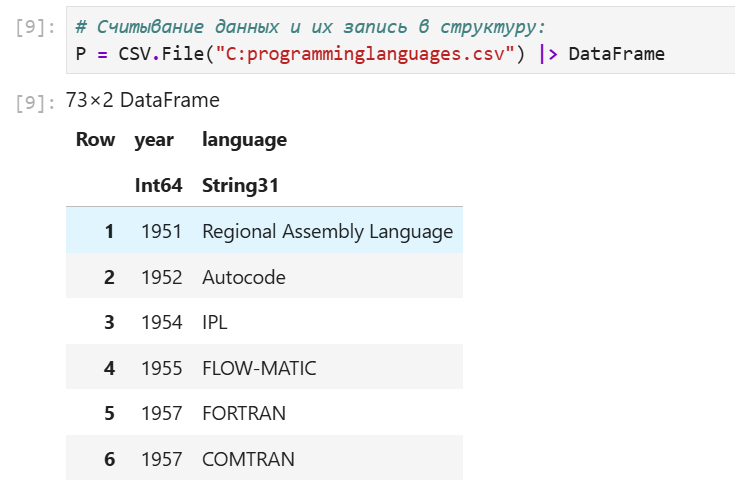
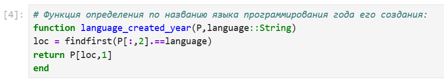
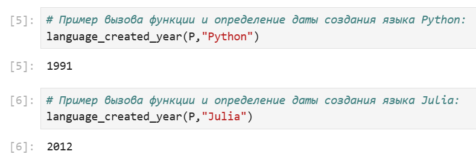
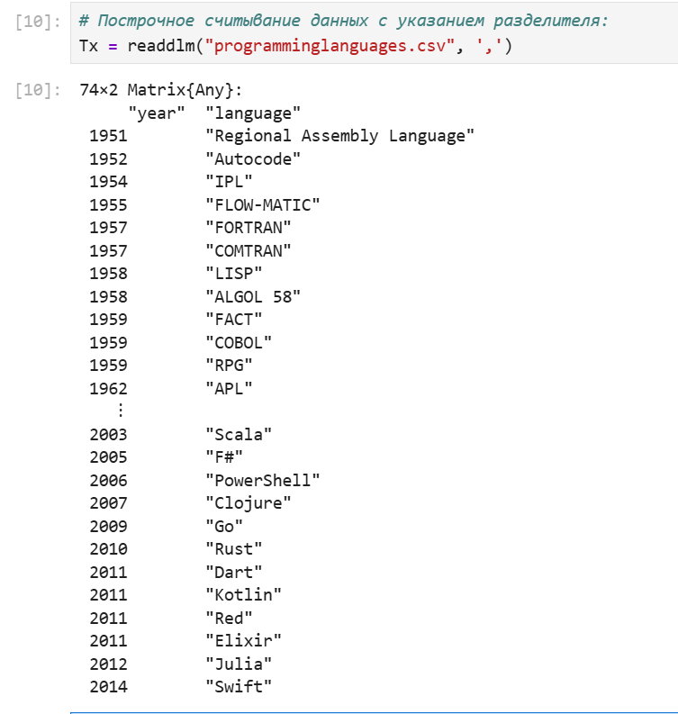
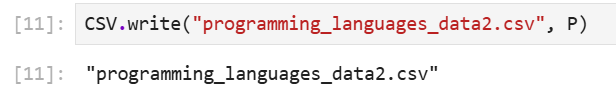

---
## Front matter
lang: ru-RU
title: Презентация по лабораторной работе №7
subtitle: Введение в работу с данными
author:
  - Компьютерный практикум по стат. анализу данных
institute:
  - Российский университет дружбы народов, Москва, Россия
date: 2026 г.

## i18n babel
babel-lang: russian
babel-otherlangs: english
## Fonts
mainfont: IBM Plex Serif
romanfont: IBM Plex Serif
sansfont: IBM Plex Sans
monofont: IBM Plex Mono
mathfont: STIX Two Math
mainfontoptions: Ligatures=Common,Ligatures=TeX,Scale=0.94
romanfontoptions: Ligatures=Common,Ligatures=TeX,Scale=0.94
sansfontoptions: Ligatures=Common,Ligatures=TeX,Scale=MatchLowercase,Scale=0.94
monofontoptions: Scale=MatchLowercase,Scale=0.94,FakeStretch=0.9
## Formatting pdf
toc: false
toc-title: Содержание
slide_level: 2
aspectratio: 169
section-titles: true
theme: metropolis
header-includes:
 - \metroset{progressbar=frametitle,sectionpage=progressbar,numbering=fraction}
---

# Информация

## Докладчик

  - Танрибергенов Эльдар
  - студент 4 курса из группы НПИбд-01-22
  - ФМиЕН, кафедра прикладной информатики и теории вероятностей
  - Российский университет дружбы народов

# Цели и задачи

## Цель работы

 Основной целью работы является изучение специализированных пакетов Julia для обработки данных.

# Результаты

## Введение в работу с данными

:::::::::::::: {.columns align=center}
::: {.column width="50%"}

{#fig:001 height="50%"}

:::
::: {.column width="50%"}

{#fig:002 height="50%"}

:::
::::::::::::::

## Введение в работу с данными

:::::::::::::: {.columns align=center}
::: {.column width="32%"}

{#fig:003}

:::
::: {.column width="32%"}

{#fig:004}

:::
::: {.column width="32%"}

{#fig:005}

:::
::::::::::::::

## Введение в работу с данными

:::::::::::::: {.columns align=center}
::: {.column width="32%"}

{#fig:006}

:::
::: {.column width="32%"}

{#fig:007}

:::
::: {.column width="32%"}

{#fig:008}

:::
::::::::::::::

# Выводы
  
## Вывод

 В результате выполнения лабораторной работы, я подготовил рабочее пространство и инструментарий для работы с языком программирования Julia, на простейших примерах познакомился с основами синтаксиса Julia.
