---
## Front matter
title: "Отчёт по лабораторной работе №7"
subtitle: "Дисциплина: Компьютерный практикум по статистическому анализу данных"
author: "Выполнил: Танрибергенов Эльдар (НПИбд-01-22)"

## Generic otions
lang: ru-RU
toc-title: "Содержание"

## Bibliography
bibliography: bib/cite.bib
csl: pandoc/csl/gost-r-7-0-5-2008-numeric.csl

## Pdf output format
toc: true # Table of contents
toc-depth: 2
lof: true # List of figures
lot: true # List of tables
fontsize: 12pt
linestretch: 1.5
papersize: a4
documentclass: scrreprt
## I18n polyglossia
polyglossia-lang:
  name: russian
  options:
	- spelling=modern
	- babelshorthands=true
polyglossia-otherlangs:
  name: english
## I18n babel
babel-lang: russian
babel-otherlangs: english
## Fonts
mainfont: IBM Plex Serif
romanfont: IBM Plex Serif
sansfont: IBM Plex Sans
monofont: IBM Plex Mono
mathfont: STIX Two Math
mainfontoptions: Ligatures=Common,Ligatures=TeX,Scale=0.94
romanfontoptions: Ligatures=Common,Ligatures=TeX,Scale=0.94
sansfontoptions: Ligatures=Common,Ligatures=TeX,Scale=MatchLowercase,Scale=0.94
monofontoptions: Scale=MatchLowercase,Scale=0.94,FakeStretch=0.9
mathfontoptions:
## Biblatex
biblatex: true
biblio-style: "gost-numeric"
biblatexoptions:
  - parentracker=true
  - backend=biber
  - hyperref=auto
  - language=auto
  - autolang=other*
  - citestyle=gost-numeric
## Pandoc-crossref LaTeX customization
figureTitle: "Рис."
tableTitle: "Таблица"
listingTitle: "Листинг"
lofTitle: "Список иллюстраций"
lotTitle: "Список таблиц"
lolTitle: "Листинги"
## Misc options
indent: true
header-includes:
  - \usepackage{indentfirst}
  - \usepackage{float} # keep figures where there are in the text
  - \floatplacement{figure}{H} # keep figures where there are in the text
---

# Цель работы

Основной целью работы является изучение специализированных пакетов Julia для обработки данных.

# Предварительные сведения

Обработка и анализ данных, полученных в результате проведения исследований, —
важная и неотъемлемая часть исследовательской деятельности. Большое значение имеет
выявление определённых связей и закономерностей в имеющихся неструктурированных
данных, особенно в данных больших размерностей. Выявленные в данных связей и закономерностей позволяет строить прогнозные модели с предполагаемым результатом. Для
решения таких задач применяют методы из таких областей знаний как математическая
статистика, программирование, искусственный интеллект, машинное обучение.
В Julia для обработки данных используются наработки из других языков программирования, в частности, из R и Python.
Перед тем, как начать проводить какие-либо операции над данными, необходимо их
откуда-то считать и возможно сохранить в определённой структуре.
Довольно часто данные для обработки содержаться в csv-файле, имеющим текстовый
формат, в котором данные в строке разделены, например, запятыми, и соответствуют
ячейкам таблицы, а строки данных соответствуют строкам таблицы. Также данные могут
быть представлены в виде фреймов или множеств.

# Выполнение лабораторной работы

В Julia для работы с такого рода структурами данных используют пакеты CSV,
DataFrames, RDatasets, FileIO:

{#fig:001}

Предположим, что у вас в рабочем каталоге с проектом есть файл с данными
programminglanguages.csv, содержащий перечень языков программирования и год их
создания. Тогда для заполнения массива данными для последующей обработки требуется
считать данные из исходного файла и записать их в соответствующую структуру:

{#fig:002}

Далее приведём пример функции, в которой на входе указывается название языка
программирования, а на выходе — год его создания:

{#fig:003}

В следующем примере при вызове функции, в качестве аргумента которой указано
слово julia, написанное со строчной буквы выдана ошибка, так как список не содержит таких данных:

{#fig:004}

Для того, чтобы убрать в функции зависимость данных от регистра, необходимо изменить исходную функцию следующим образом:

{#fig:005}

Можно считывать данные построчно, с элементами, разделенными заданным разделителем:

{#fig:006}

## Запись данных в файл

Предположим, что требуется записать имеющиеся данные в файл. Для записи данных
в формате CSV можно воспользоваться следующим вызовом:

Можно задать тип файла и разделитель данных:

{#fig:007}

Можно проверить, используя readdlm, корректность считывания созданного текстового файла:

{#fig:008}

## Словари

При работе с данными бывает удобно записать их в формате словаря.
Предположим, что словарь должен содержать перечень всех языков программирования
и года их создания, при этом при указании года выводить все языки программирования,
созданные в этом году.
При инициализации словаря можно задать конкретные типы данных для ключей
и значений:

{#fig:009}

В последнем случае словарь принимает ключи и значения любого типа.
Далее требуется заполнить словарь ключами и годами, которые содержат все языки
программирования, созданные в каждом году, в качестве значений:

{#fig:010}

В результате при вызове словаря можно, выбрав любой год, узнать, какие языки программирования были созданы в этом году:

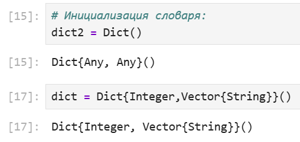{#fig:011}

## DataFrames

Работа с данными, записанными в структуре DataFrame, позволяет использовать индексацию и получить доступ к столбцам по заданному имени заголовка или по индексу
столбца.
На примере с данными о языках программирования и годах их создания зададим
структуру DataFrame:

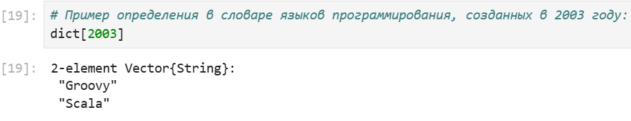{#fig:012}

Если требуется получить доступ к столбцам по имени заголовка, то необходимо добавить к имени заголовка двоеточие:

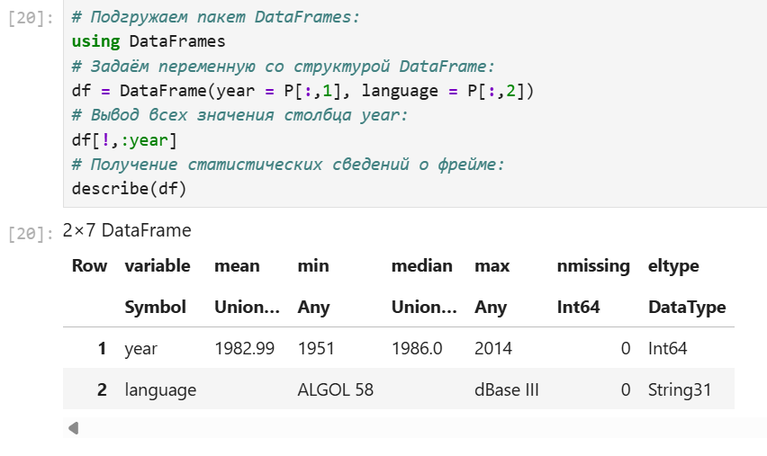{#fig:013}

В Julia это означает, что имена заголовков обрабатываются как символы. Также следует
иметь в виду, что вызов df[1] эквивалентен вызову df [:year].
Пакет DataFrames предоставляет возможность с помощью description получить основные статистические сведения о каждом столбце во фрейме данных:

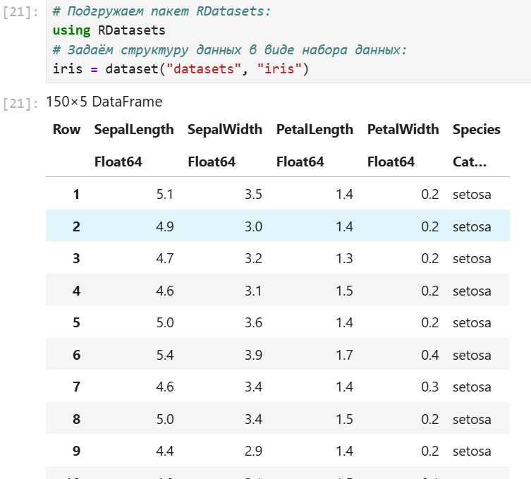{#fig:014}

## RDatasets

С данными можно работать также как с наборами данных через пакет RDatasets
языка R:

{#fig:015}

В данном случает набор данных содержит сведения о цветах. При этом следует иметь
в виду, что данные, загруженные с помощью набора данных, хранятся в виде DataFrame:

Пакет RDatasets также предоставляет возможность с помощью description получить
основные статистические сведения о каждом столбце в наборе данных:

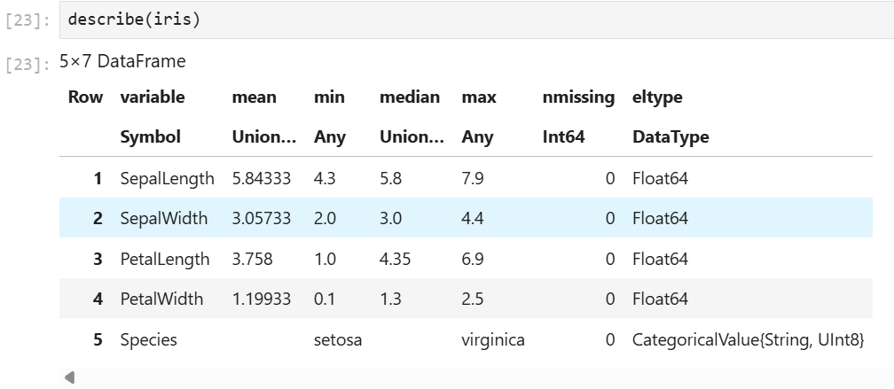{#fig:016}

## Работа с переменными отсутствующего типа (Missing Values)

Пакет DataFrames позволяет использовать так называемый «отсутствующий» тип:

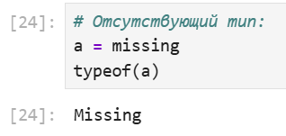{#fig:017}

Предположим есть перечень продуктов, для которых заданы калории:

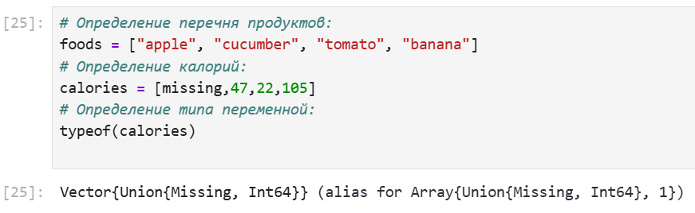{#fig:018}

В массиве значений калорий есть значение с отсутствующим типом:

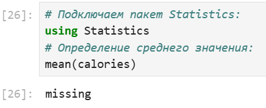{#fig:019}

При попытке получить среднее значение калорий, ничего не получится из-за наличия
переменной с отсутствующим типом:

{#fig:020}

Для решения этой проблемы необходимо игнорировать отсутствующий тип:

{#fig:021}

Далее показано, как можно сформировать таблицы данных и объединить их в один
фрейм:

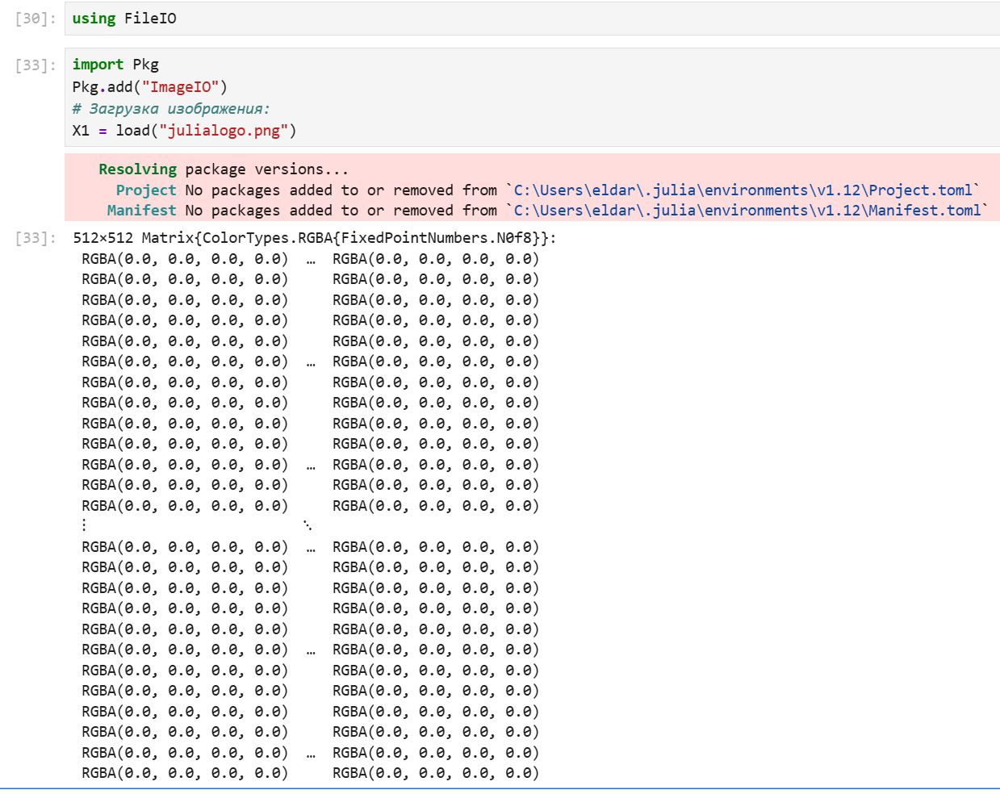{#fig:022}

## FileIO

В Julia можно работать с так называемыми «сырыми» данными, используя пакет FileIO

Попробуем посмотреть, как Julia работает с изображениями.
Подключим соответствующий пакет:

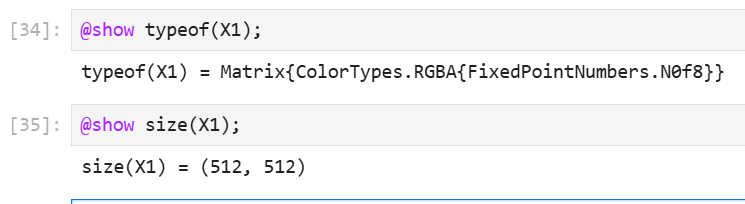{#fig:023}

Загрузим изображение (в данном случае логотип Julia):

Julia хранит изображение в виде множества цветов:

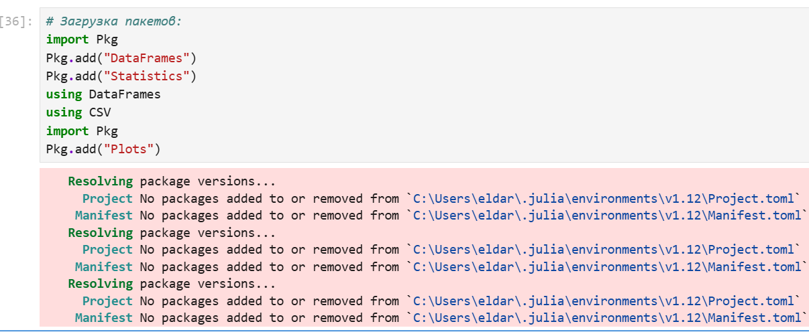{#fig:024}

## Обработка данных: стандартные алгоритмы машинного обучения в Julia

Кластеризация данных. Метод k-средних.
Задача кластеризации данных заключается в формировании однородной группы упорядоченных по какому-то признаку данных.
Метод k-средних позволяет минимизировать суммарное квадратичное отклонение
точек кластеров от центров этих кластеров.

Рассмотрим задачу кластеризации данных на примере данных о недвижимости. Файл
с данными houses.csv содержит список транзакций с недвижимостью в районе Сакраменто, о которых было сообщено в течение определённого числа дней.
Сначала подключим необходимые для работы пакеты:

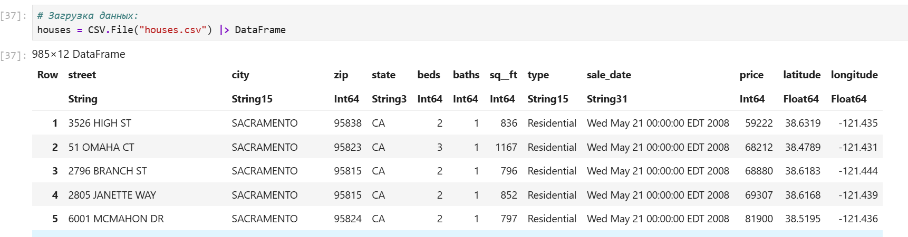{#fig:025}

Затем загрузим данные:

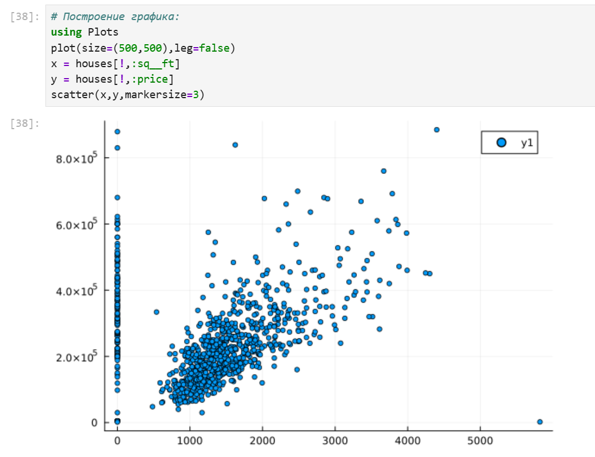{#fig:026}

Построим график цен на недвижимость в зависимости от площади:

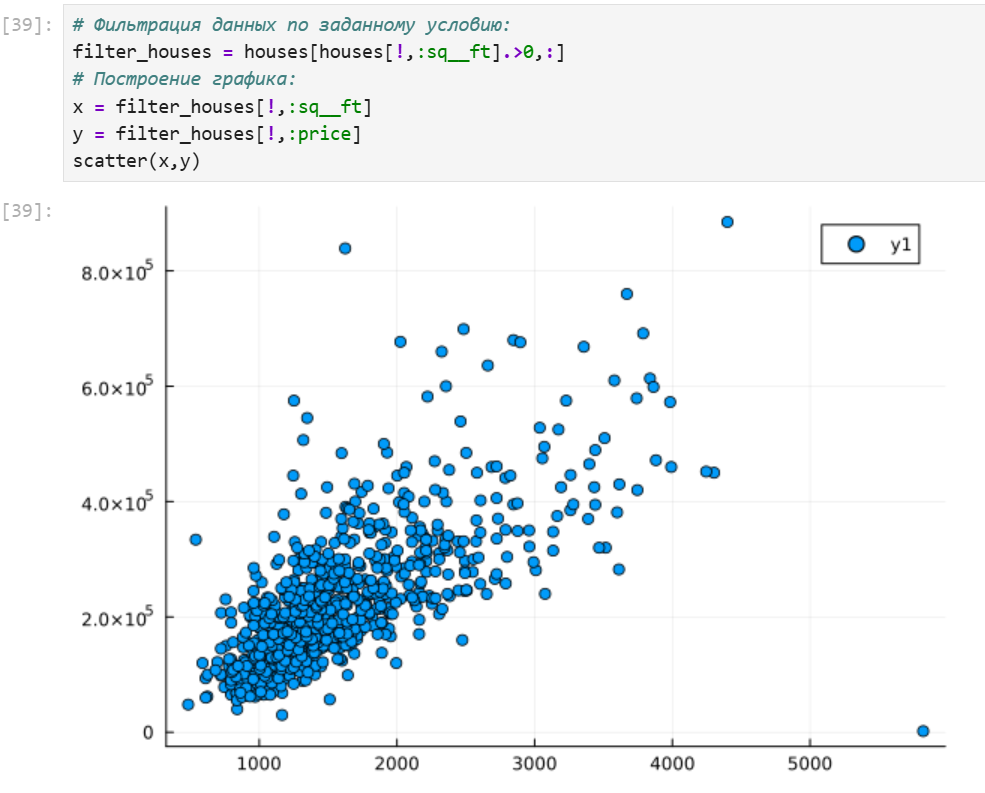{#fig:027}

Как видно из графика , имеются так называемые «артефакты», т.е. проявляются отсутствующие или невозможные сведения в исходных данных, например, цены на
недвижимость нулевой площади.
Для того чтобы избавиться от такого эффекта, можно отфильтровать и исключить такие
значения, получить более корректный график цен:

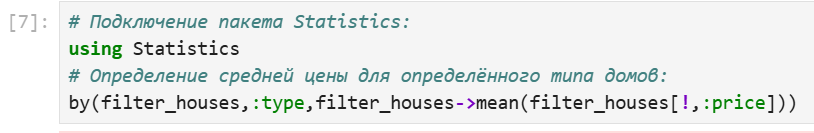{#fig:028}

Используя для фильтрации значений функцию by пакета DataFrames и для вычисления
среднего значения функцию mean пакета Statistics, можно посмотреть среднюю цену
домов определённого типа:

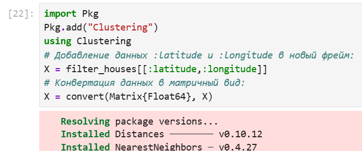{#fig:029}

Отфильтровав таким образом данные, можно приступить к формированию кластеров.
Сначала подключаем необходимые пакеты и формируем данные в нужном виде:

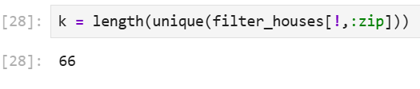{#fig:030}

# Выводы

 В результате выполнения лабораторной работы, я изучил специализированные пакеты Julia для обработки данных.

