---
## Front matter
title: "Отчёт по лабораторной работе №8"
subtitle: "Дисциплина: Компьютерный практикум по статистическому анализу данных"
author: "Выполнил: Танрибергенов Эльдар (НПИбд-01-22)"

## Generic otions
lang: ru-RU
toc-title: "Содержание"

## Bibliography
bibliography: bib/cite.bib
csl: pandoc/csl/gost-r-7-0-5-2008-numeric.csl

## Pdf output format
toc: true # Table of contents
toc-depth: 2
lof: true # List of figures
lot: true # List of tables
fontsize: 12pt
linestretch: 1.5
papersize: a4
documentclass: scrreprt
## I18n polyglossia
polyglossia-lang:
  name: russian
  options:
	- spelling=modern
	- babelshorthands=true
polyglossia-otherlangs:
  name: english
## I18n babel
babel-lang: russian
babel-otherlangs: english
## Fonts
mainfont: IBM Plex Serif
romanfont: IBM Plex Serif
sansfont: IBM Plex Sans
monofont: IBM Plex Mono
mathfont: STIX Two Math
mainfontoptions: Ligatures=Common,Ligatures=TeX,Scale=0.94
romanfontoptions: Ligatures=Common,Ligatures=TeX,Scale=0.94
sansfontoptions: Ligatures=Common,Ligatures=TeX,Scale=MatchLowercase,Scale=0.94
monofontoptions: Scale=MatchLowercase,Scale=0.94,FakeStretch=0.9
mathfontoptions:
## Biblatex
biblatex: true
biblio-style: "gost-numeric"
biblatexoptions:
  - parentracker=true
  - backend=biber
  - hyperref=auto
  - language=auto
  - autolang=other*
  - citestyle=gost-numeric
## Pandoc-crossref LaTeX customization
figureTitle: "Рис."
tableTitle: "Таблица"
listingTitle: "Листинг"
lofTitle: "Список иллюстраций"
lotTitle: "Список таблиц"
lolTitle: "Листинги"
## Misc options
indent: true
header-includes:
  - \usepackage{indentfirst}
  - \usepackage{float} # keep figures where there are in the text
  - \floatplacement{figure}{H} # keep figures where there are in the text
---

# Цель работы

Основная цель работа — освоить пакеты Julia для решения задач оптимизации.

# Предварительные сведения

Под оптимизацией в математике и информатике понимается решение задачи нахождения экстремума (минимума или максимума) целевой функции в некоторой области
конечномерного векторного пространства, ограниченной набором линейных и/или нелинейных равенств и/или неравенств.
Оптимизационной задачей называется задача определения наилучших с точки зрения
структуры или значений параметров объектов.

# Выполнение лабораторной работы

## Линейное программирование

Линейное программирование рассматривает решения экстремальных задач на множествах 𝑛-мерного векторного пространства, задаваемых системами линейных уравнений и неравенств.
Общей (стандартной) задачей линейного программирования называется задача нахождения минимума линейной целевой функции вида:

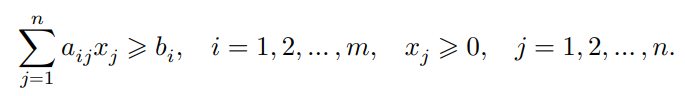{#fig:001}

где $\vec{c}$ — некоторые коэффициенты, $\vec{x} \in \mathbb{R}^n$

Основной задачей линейного программирования называется задача, в которой есть ограничения в форме неравенств:

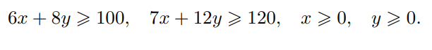{#fig:002}

Задачи линейного программирования со смешанными ограничениями, такими как
равенства и неравенства, с наличием переменных, свободных от ограничений, могут быть
сведены к эквивалентным с тем же множеством решений путём замены переменных
и замены равенств на пару неравенств.
В Julia есть несколько средств, предназначенных для решения оптимизационных задач.
Одним из таких средств является JuMP (https://jump.dev/) — язык моделирования
и вспомогательные пакеты для формулирования и решения задач математической оптимизации в Julia.
JuMP включает пакет Convex.jl (https://jump.dev/Convex.jl/stable/), позволяющий описать задачу оптимизации, используя естественный математический синтаксис,
и решать её с помощью одного из решателей (COSMO, ECOS, SCS, GLPK, MathOptInterface).
Предположим, что требуется решить следующую задачу линейного программирования:

$12x + 20y → min$

при заданных ограничениях:

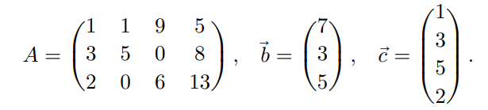{#fig:003}

Воспользуемся JuMP и решателем линейного и смешанного целочисленного программирования GLPK:

{#fig:004}

Объект модели (контейнер для переменных, ограничений, параметров решателя и т. д.)
в JuMP создаётся при помощи функции Model(), в которой в качестве аргумента указывается оптимизатор (решатель):

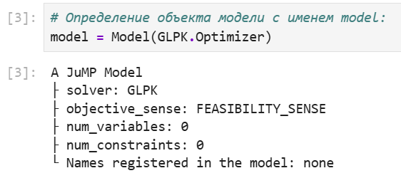{#fig:005}

Переменные задаются с помощью конструкции @variable (имя объекта модели, имя
и привязка переменной, тип переменной). Здесь же задаются граничные условия на
переменные (если тип переменной не определён, он считается действительным):

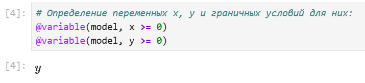{#fig:006}

В качестве первого аргумента указан объект модели model, затем переменные 𝑥 и 𝑦,
связанные с этой моделью (причём указанные переменные не могут использоваться
в другой модели).
Ограничения модели задаются с помощью конструкции @constraint (имя объекта
модели, ограничение):

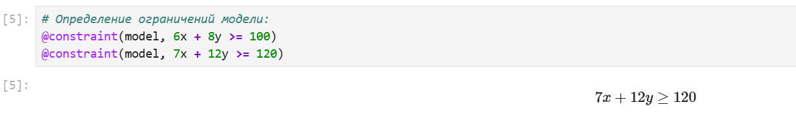{#fig:007}

Далее следует задать собственно целевую функцию с помощью конструкции
@objective (имя объекта модели, Min или Max, функция для оптимизации):

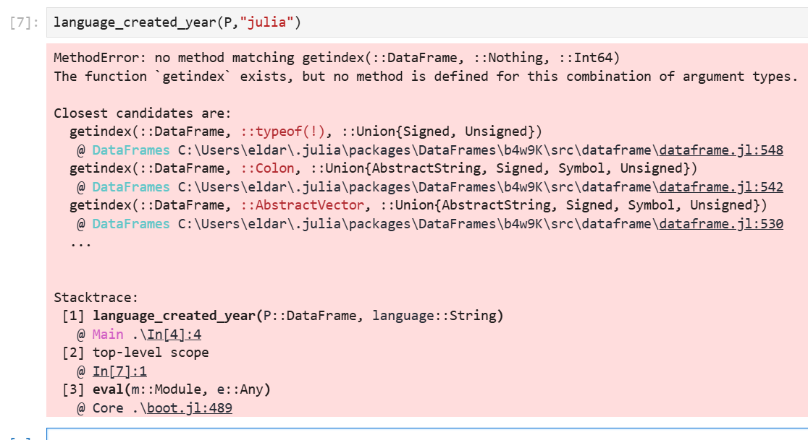{#fig:008}

Для решения задачи оптимизации необходимо вызывать функцию оптимизации:

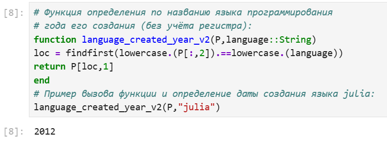{#fig:009}

Следует проверять причину прекращения работы оптимизатора, используя конструкцию termination_status(Объект модели):

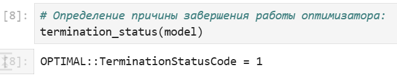{#fig:010}

Процесс решения мог быть прекращён по ряду причин. Во-первых, решатель мог
найти оптимальное решение или доказать, что проблема невозможна. Однако он также
мог столкнуться с численными трудностями или прерваться из-за таких настроек, как
ограничение по времени. Если возвращено значение OPTIMAL, найдено оптимальное
решение.
Наконец, можно посмотреть собственно результат решения оптимизационной задачи:

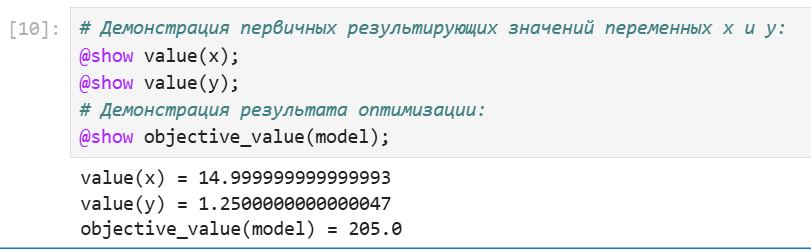{#fig:011}

## Векторизованные ограничения и целевая функция оптимизации

Часто бывает полезно создавать коллекции переменных JuMP внутри более сложных
структур данных. Можно добавить ограничения и цель в JuMP, используя векторизованную линейную алгебру.
Предположим, что требуется решить следующую задачу:

$\vec{c}^T \vec{x} \rightarrow \text{min}$

при заданных ограничениях:

$A\vec{x} = \vec{b}, \quad \vec{x} \geq 0, \quad \vec{x} \in \mathbb{R}$

где

$$
A = \begin{pmatrix}
1 & 1 & 9 & 5 \\
3 & 5 & 0 & 8 \\
2 & 0 & 6 & 13
\end{pmatrix}, \quad
\vec{b} = \begin{pmatrix}
7 \\
3 \\
5
\end{pmatrix}, \quad
\vec{c} = \begin{pmatrix}
1 \\
3 \\
5 \\
2
\end{pmatrix}.
$$

Воспользуемся JuMP и решателем линейного и смешанного целочисленного программирования GLPK:

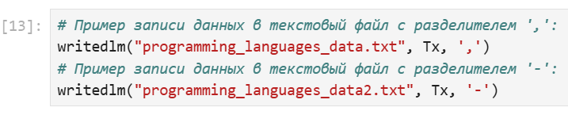{#fig:012}

Определим объект модели:

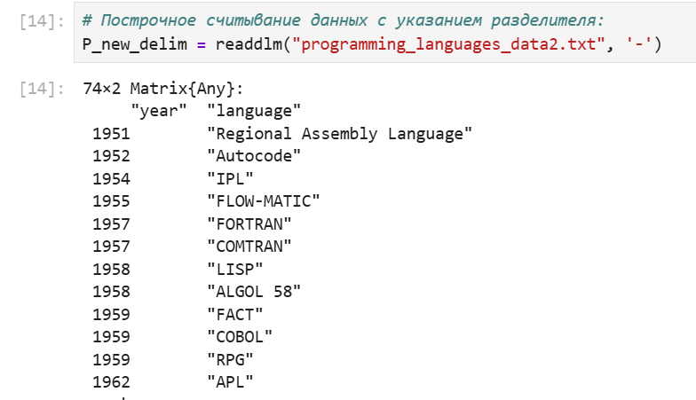{#fig:013}

Зададим исходные значения матрицы A и векторов $\vec{b}$,$\vec{c}$ :

{#fig:014}

Далее зададим массив переменных для компонент вектора $\vec{x}$ :

{#fig:015}

Затем зададим ограничения в соответствии с условиями модели:

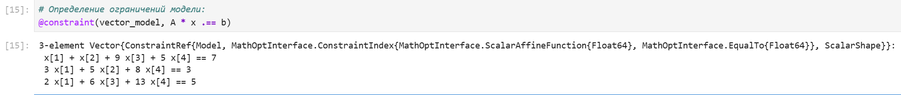{#fig:016}

Далее зададим целевую функцию:

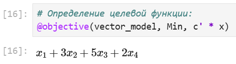{#fig:017}

Наконец, для решения задачи оптимизации вызовем функцию оптимизации:

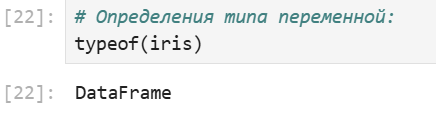{#fig:018}

Проверим, что найдено оптимальное решение:

{#fig:019}

Посмотрим результат решения оптимизационной задачи:

{#fig:020}

## Оптимизация рациона питания

В некоторых задачах требуется использование массивов, в которых индексы не являются целыми диапазонами с отсчётом от единицы. Например, требуется использовать
переменную, индексируемую по названию продукта или местоположению. Тогда необходимо в качестве индекса использовать произвольный вектор. В Julia это можно
реализовать с помощью DenseAxisArrays.
Рассмотрим применение DenseAxisArrays на примере решения задачи оптимизации
рациона питании в заведении быстрого питания при условии, что задано ограничение
на количество потребляемых калорий (1800–2200), белков (⩾ 91), жиров (0–65) и соли
(0–1779), а также перечень определённых продуктов питания с указанием их стоимости
— гамбургер (2.49 ден.ед.), курица (2.89 ден.ед.), сосиска в тесте (1.50 ден.ед.), жареный
картофель (1.89 ден.ед.), макароны (2.09 ден.ед.), пицца (1.99 ден.ед.), салат (2.49 ден.ед.),
молочный коктейль (0.89 ден.ед.), мороженное (1.59 ден.ед.). Также известно содержание
калорий, белков, жиров и соли в указанных продуктах.

Воспользуемся JuMP и решателем линейного и смешанного целочисленного программирования GLPK :

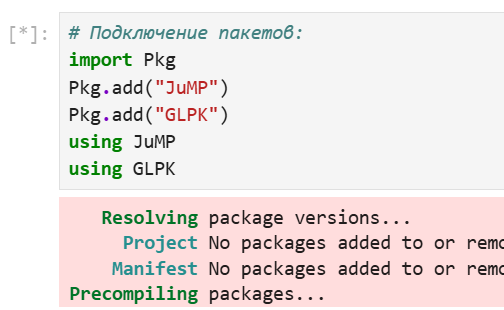{#fig:021}

Создадим контейнер JuMP для хранения информации об ограничениях (минимальное,
максимальное) на количество потребляемых калорий, белков, жиров и соли:

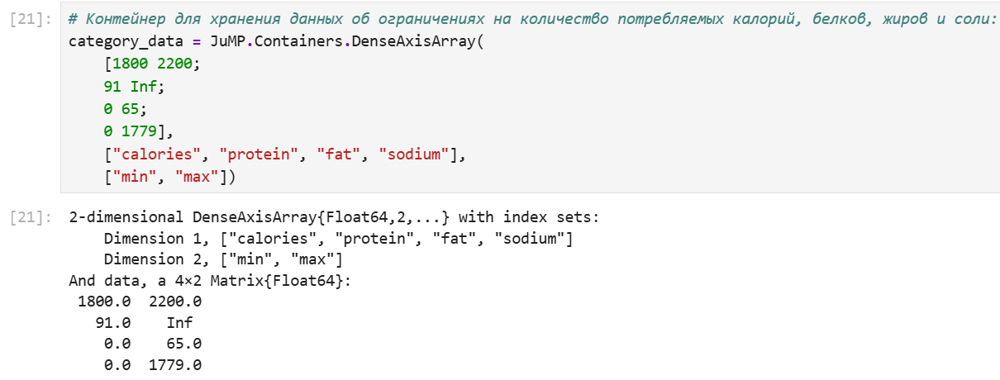{#fig:022}

Введём массив данных с наименованиями продуктов:

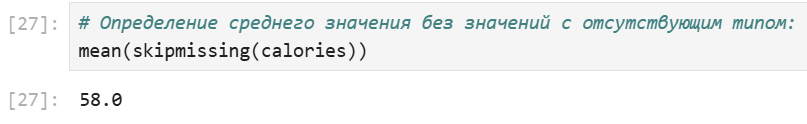{#fig:023}

Введём данные о стоимости продуктов:

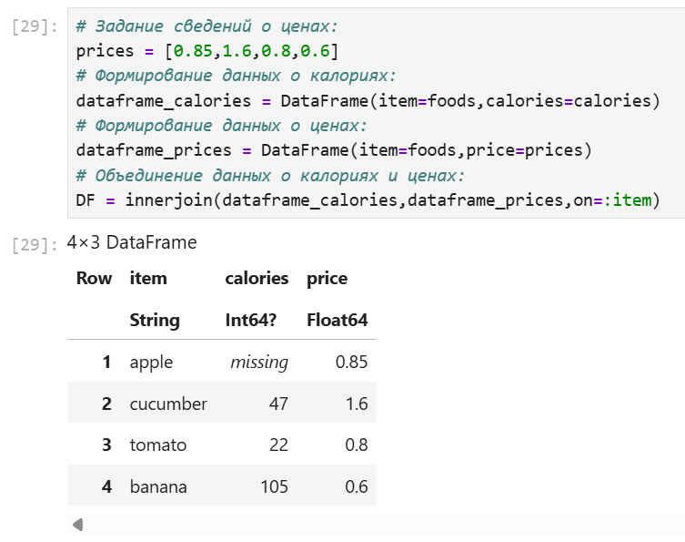{#fig:024}

Введём сведения о содержании калорий, белков, жиров и соли в продуктах питания:

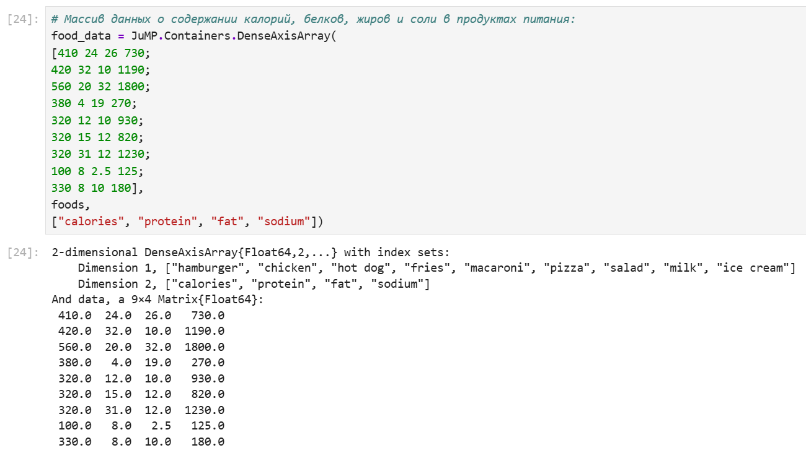{#fig:025}

Определим объект модели:

{#fig:026}

Определим массив:

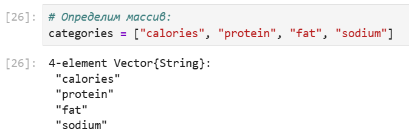{#fig:027}

Далее зададим переменные:

{#fig:028}

Задаём целевую функцию минимизации цены:

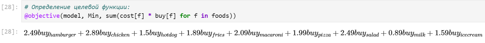{#fig:029}

Затем зададим ограничения в соответствии с условиями модели:

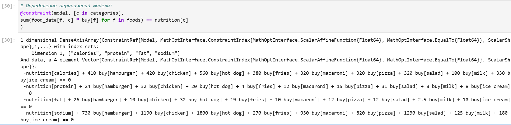{#fig:030}

Наконец, для решения задачи оптимизации вызовем функцию оптимизации:

{#fig:031}

Для просмотра результата решения модно вывести значение переменной buy:

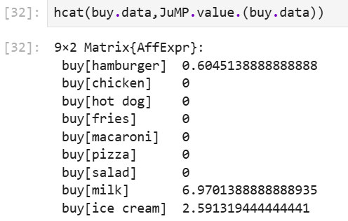{#fig:032}

В результате оптимальным по цене и пищевой ценности будет предложено купить
гамбургер, молочный коктейль и мороженное.

## Путешествие по миру

Рассмотрим решение задачи определения оптимального числа паспортов, требующихся, чтобы объехать весь мир. При этом будем учитывать сведения о паспортах
и ограничениях, указанных на ресурсе https://www.passportindex.org/. В табличной форме данные можно получить с ресурса https://github.com/ilyankou/
passport-index-dataset. Для решения задачи представляют интерес данные, указанные в файле passport-index-matrix.csv, в котором в первым столбце (Passport)
указана страна отбытия (= от), в остальных столбцах указаны страны назначения (= до),
на пересечении строк и столбцов указаны условия по наличию или отсутствию визы или
другие ограничения

Итак, попробуем решить задачу средствами Julia.
Сначала требуется скачать файл с данными. Например для ОС типа Linux можно воспользоваться стандартным вызовом команды git с соответствующими параметрами:

{#fig:033}

Затем требуется подключить пакеты для обработки табличных файлов:

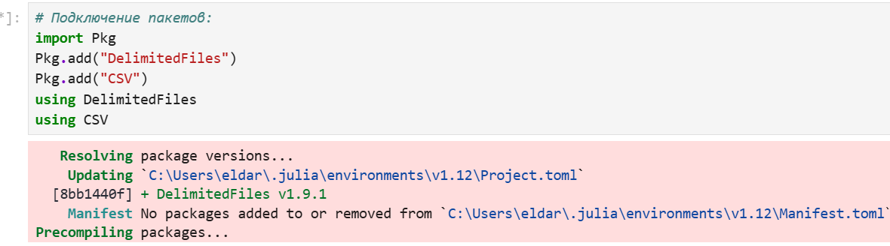{#fig:034}

Можем считать данные из имеющегося файла:

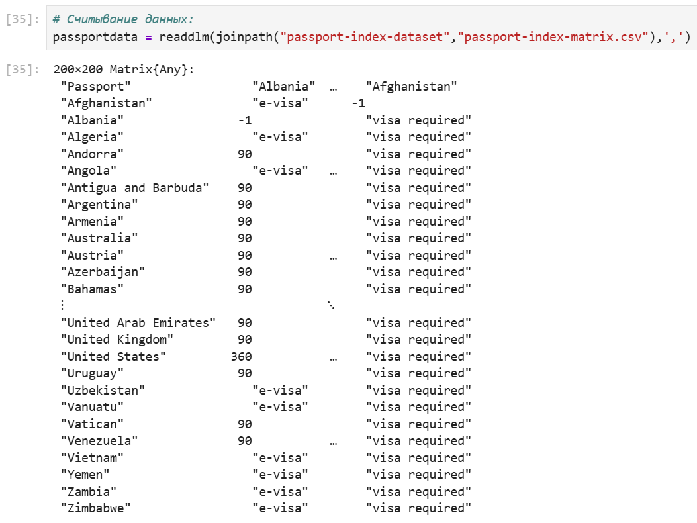{#fig:035}

Для решения задачи используем возможности пакета JuMP и решателя линейного
и смешанного целочисленного программирования GLPK:

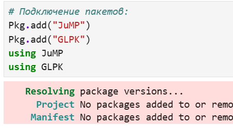{#fig:036}

Далее просматриваем файл, задаём переменную для подсчёта числа паспортов, задаём
переменную vf, в которую заносим сведения при отсутствии необходимости получать
визу (если в поле указано число, «VF» или «VOA»):

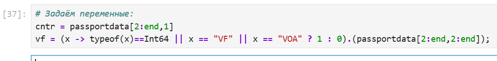{#fig:037}

Определяем объект модели:

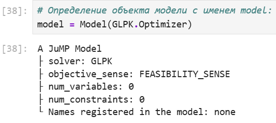{#fig:038}

Добавляем переменные, ограничения и целевую функцию:

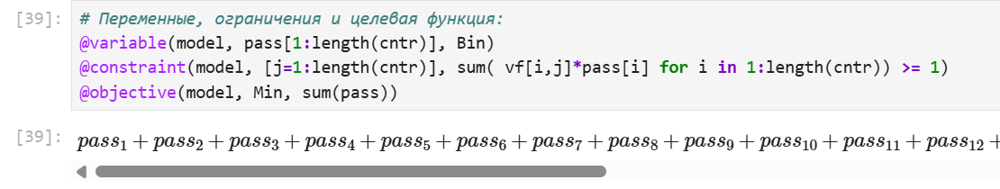{#fig:039}

Для решения задачи оптимизации вызываем функцию оптимизации:

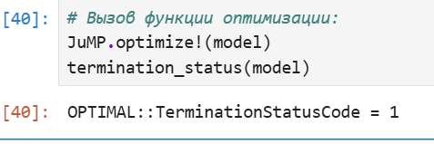{#fig:040}

Просматриваем результат:

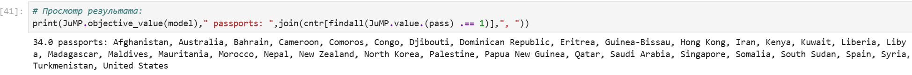{#fig:041}

## Портфельные инвестиции

Портфельные инвестиции — размещение капитала в ценные бумаги, формируемые
в виде портфеля ценных бумаг, с целью получения прибыли.
Инвестиционный портфель — процесс стратегического управления капиталом как
оптимизированной, единой системой инвестиционных ценностей.
Предположим требуется решить оптимизационную задачу в следующей формулировке.
Имеется капитал в 1000 ден. ед., который планируется инвестировать в три компании —
Microsoft, Facebook, Apple. При этом есть данные еженедельных значений цен на акции
этих компаний за определённый период времени. Необходимо определить доходность
акций каждой компании за рассматриваемый период времени, после чего инвестировать
в эти три компании так, чтобы получить возврат в размере не менее 2% от вложенной
суммы.
Для решения оптимизационной задачи будем использовать пакет Convex.jl и оптимизатор (решатель) SCS. Кроме того, понадобится пакет Statistics.jl для получения
матрицы рисков на основе расчёта ковариационных значений по доходности.

Сначала требуется подгрузить имеющиеся данные о еженедельных значениях цен
на акции рассматриваемых компаний, отобразить данные на графике. Предположим
данные размещены в файле stock_prices.xlsx в каталоге data в проекте.
Подключаем пакеты:

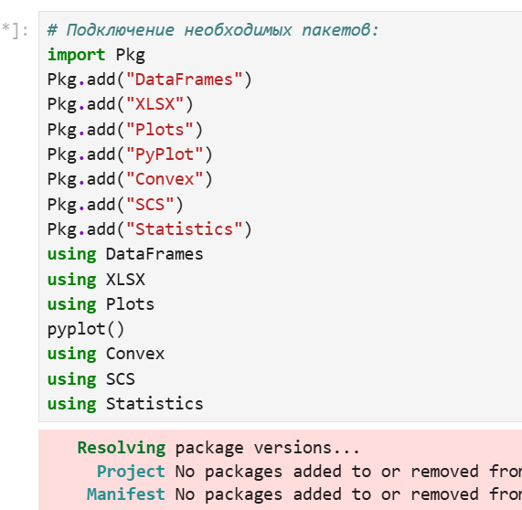{#fig:042}

Подгружаем данные еженедельных значений цен на акции компаний за определённый
период времени во фрейм:

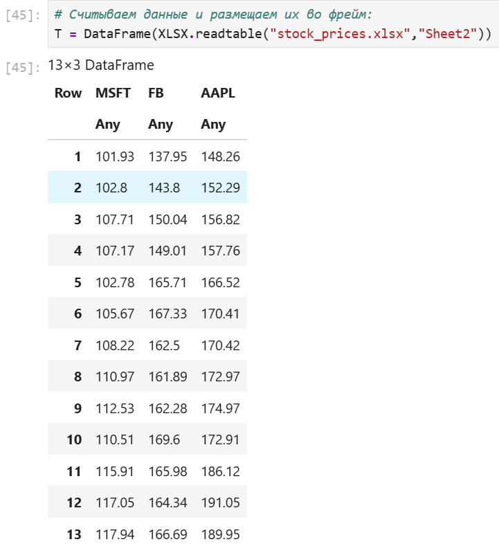{#fig:043}

Отображаем данные на графике:

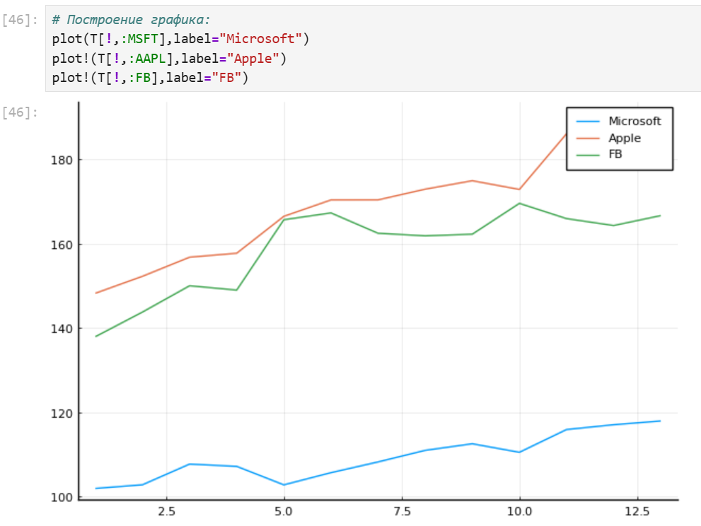{#fig:044}

Для дальнейших расчётов данные по ценам на акции переформируем из фрейма
в матрицу:

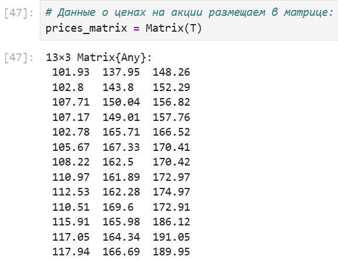{#fig:045}

Вычисление матрицы доходности за период времени:

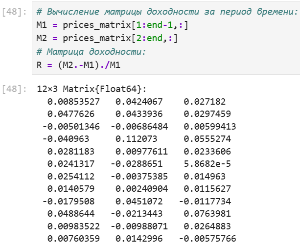{#fig:046}

Далее необходимо сформировать матрицу рисков — ковариационную матрицу рассчитанных цен доходности:

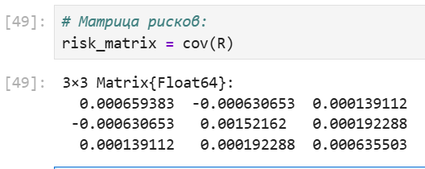{#fig:047}

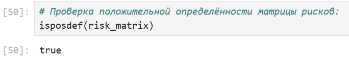{#fig:048}

Доход от каждой из компаний получим из матрицы доходности как вектор средних
значений:

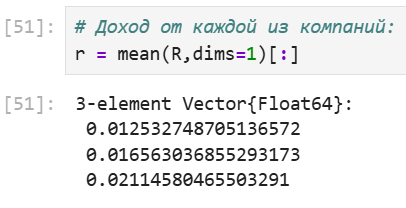{#fig:049}

Формируем вектор инвестиций:

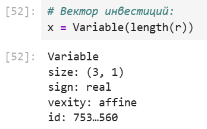{#fig:050}

Определяем объект модели в соответствии с формулировкой оптимизационной задачи (при этом делаем задачу совместимой с DCP в соответствии с требованием пакета
Convex.jl — см. http://cvxr.com/cvx/doc/dcp.html)

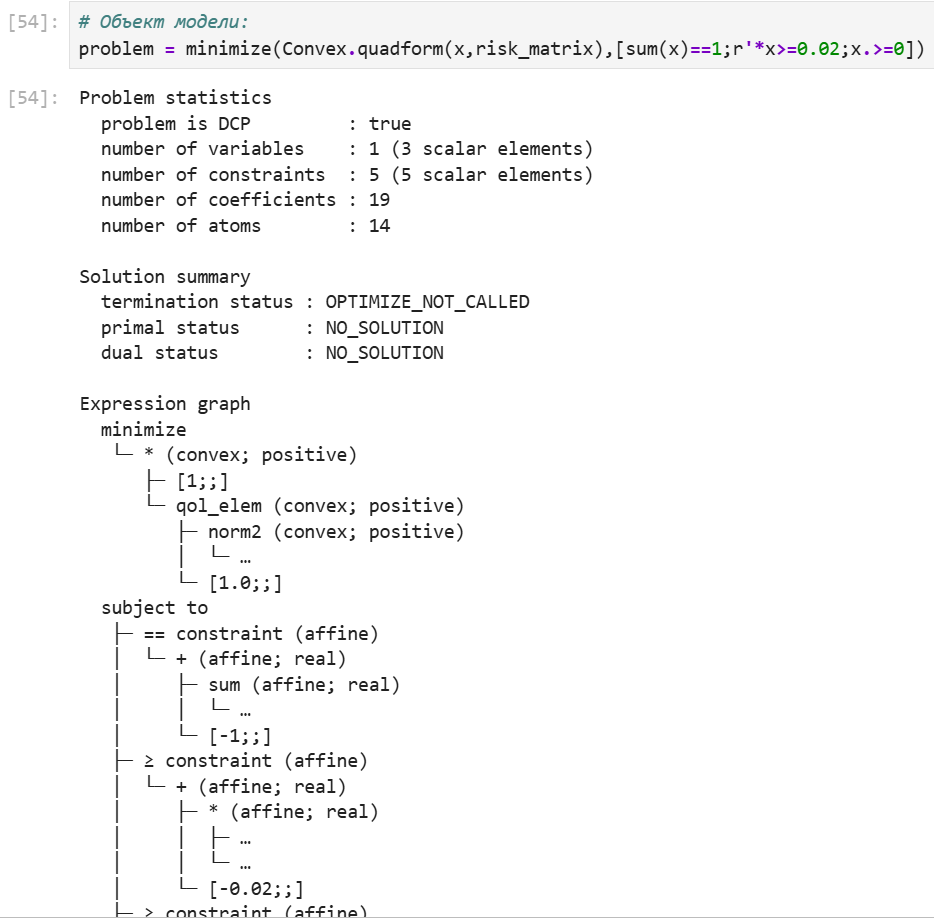{#fig:051}

Решаем поставленную задачу:

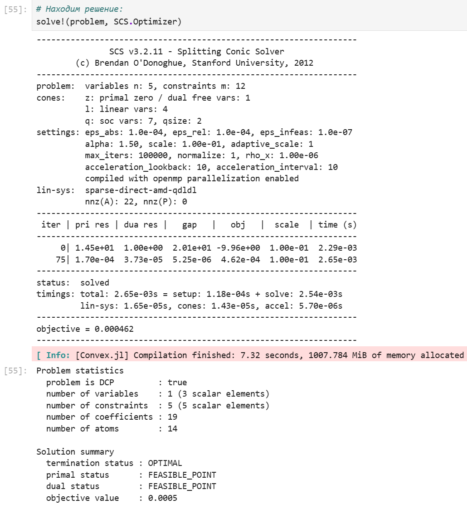{#fig:052}

Выводим значения компонент вектора инвестиций:

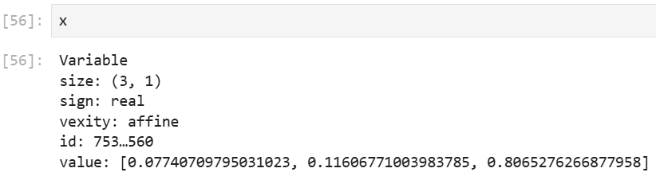{#fig:053}

Проверяем выполнение условия $\sum_{i=1}^{3} x_{i} = 1$ :

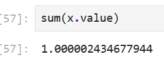{#fig:054}

Проверяем выполнение условия на уровень доходности от 2%:

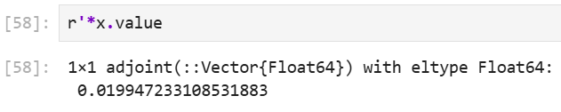{#fig:055}

Переводим процентные значения компонент вектора инвестиций в фактические денежные единицы:

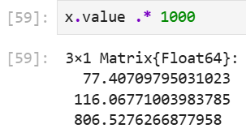{#fig:056}

В результате, получаем: надо инвестировать 67.9 ден. ед. в Microsoft, 122.3 ден. ед.
в Facebook, 809.7 ден. ед. в Apple.

## Восстановление изображения

Предположим есть изображение, на котором были изменены некоторые пиксели. Требуется восстановить неизвестные пиксели путём решения задачи оптимизации.
Будем использовать пакет Convex.jl и оптимизатор (решатель) SCS, пакет
ImageMagick.jl для работы с изображениями:

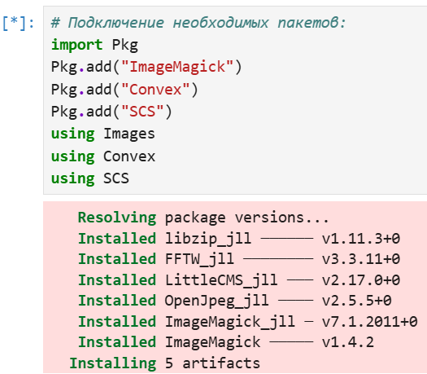{#fig:057}

Загрузим изображение для последующей обработки:

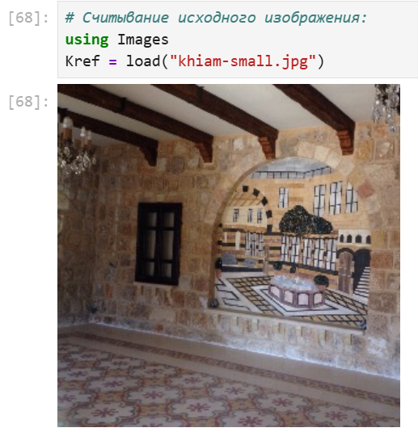{#fig:058}

Преобразуем изображение в оттенки серого и испортим некоторые пиксели:

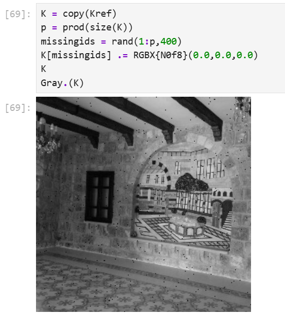{#fig:059}

Формируем матрицу со значениями цветов:

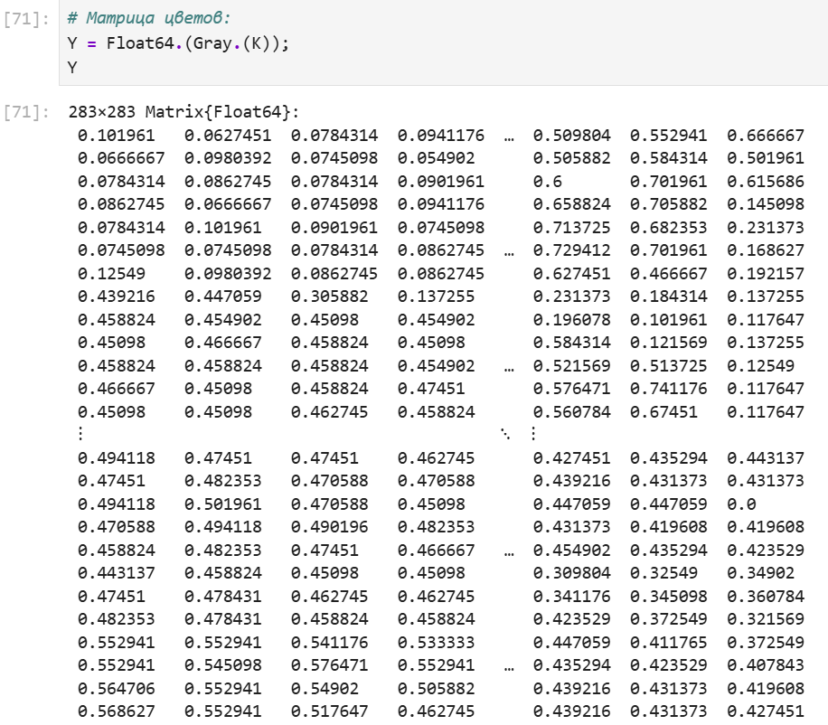{#fig:060}

Далее необходимо сформировать новую матрицу 𝑋, в которой минимизируется норма
ядра матрицы (т.е. сумма сингулярных чисел элементов матрицы) так, что элементы,
которые уже известны в матрице 𝑌, остаются теми же самыми в матрице 𝑋:

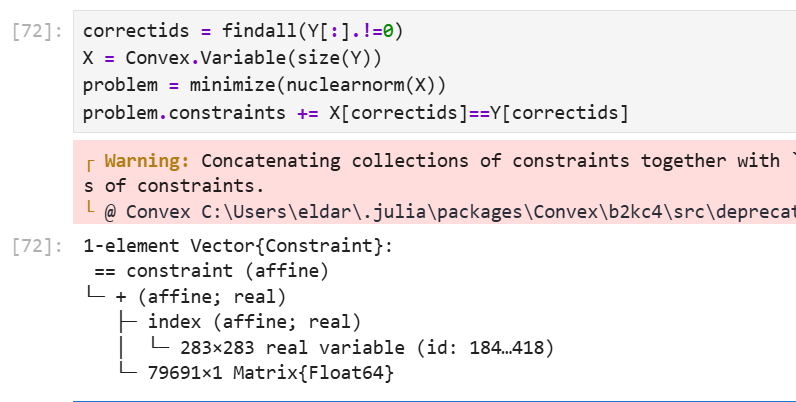{#fig:061}

Решаем поставленную задачу:

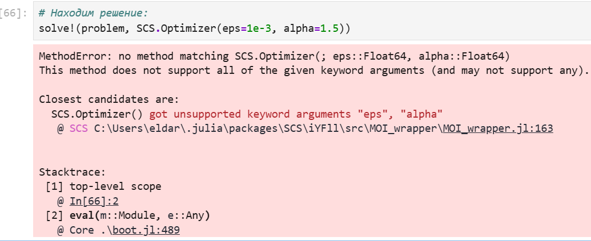{#fig:062}

## Задания для самостоятельного выполнения

1.

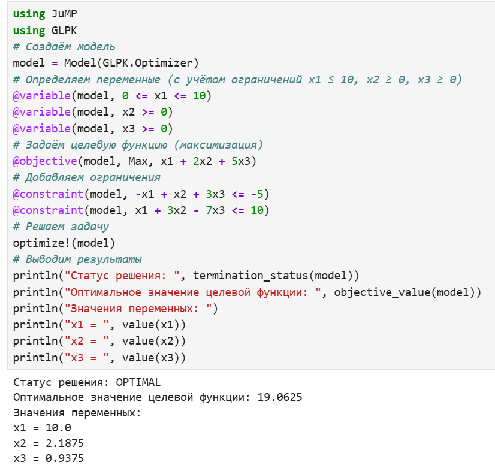{#fig:063}

2.

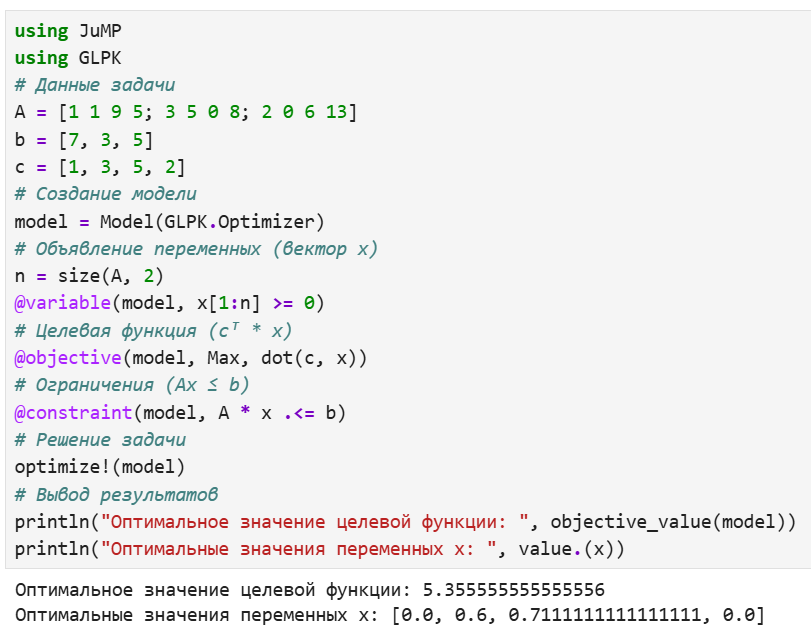{#fig:064}

3.

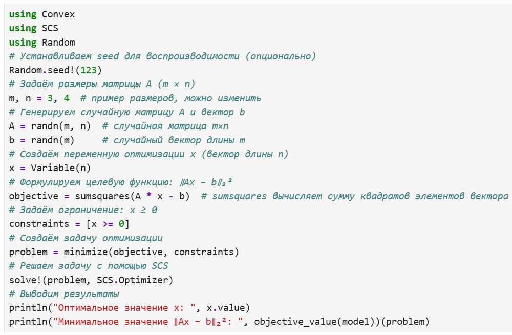{#fig:065}

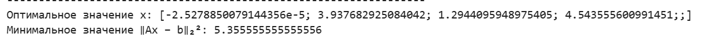{#fig:066}

# Выводы

 В результате выполнения лабораторной работы, я освоил пакеты Julia для решения задач оптимизации.

